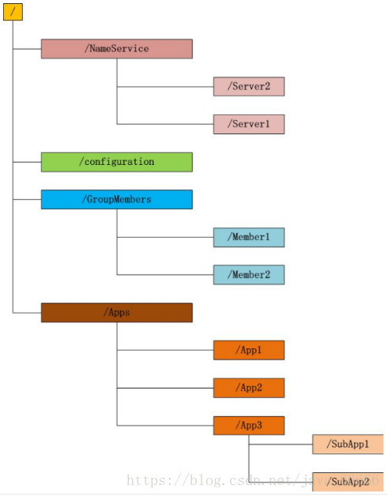
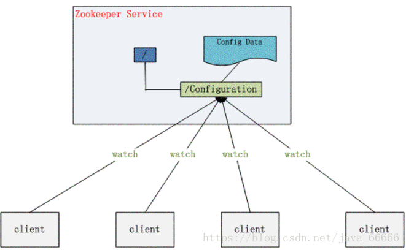
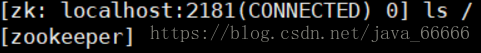
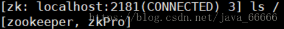
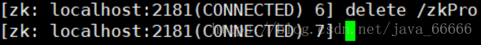

[TOC]
# Zookeeper是什么
官方文档上这么解释zookeeper，它是一个分布式服务框架，是Apache Hadoop 的一个子项目，

它主要是用来解决分布式应用中经常遇到的一些数据管理问题，如：
* 统一命名服务
* 状态同步服务
* 集群管理
* 分布式应用配置项的管理等。

简单来说zookeeper=文件系统+监听通知机制。

## 1. 文件系统

Zookeeper维护一个类似文件系统的数据结构：


每个子目录项如 NameService 都被称作为 znode(目录节点)，和文件系统一样，我们能够自由的增加、删除znode，在一个znode下增加、删除子znode，唯一的不同在于znode是可以存储数据的。


有四种类型的znode：
* **PERSISTENT-持久化目录节点**，客户端与zookeeper断开连接后，该节点依旧存在

* **PERSISTENT_SEQUENTIAL-持久化顺序编号目**录, 节点客户端与zookeeper断开连接后，该节点依旧存在，只是Zookeeper给该节点名称进行顺序编号

* **EPHEMERAL-临时目录节点**，客户端与zookeeper断开连接后，该节点被删除

* **EPHEMERAL_SEQUENTIAL-临时顺序编号目录节点**，客户端与zookeeper断开连接后，该节点被删除，只是Zookeeper给该节点名称进行顺序编号

## 2. 监听通知机制

客户端注册监听它关心的目录节点，当目录节点发生变化（数据改变、被删除、子目录节点增加删除）时，zookeeper会通知客户端。

# Zookeeper能做什么

zookeeper功能非常强大，可以实现诸如分布式应用配置管理、统一命名服务、状态同步服务、集群管理等功能，我们这里拿比较简单的分布式应用配置管理为例来说明。

假设我们的程序是分布式部署在多台机器上，如果我们要改变程序的配置文件，需要逐台机器去修改，非常麻烦，现在把这些配置全部放到zookeeper上去，保存在 zookeeper 的某个目录节点中，然后所有相关应用程序对这个目录节点进行监听，一旦配置信息发生变化，每个应用程序就会收到 zookeeper 的通知，然后从 zookeeper 获取新的配置信息应用到系统中。



# Zookeeper单机模式安装

1. 配置JAVA环境，检验环境：java -version。

2. 下载并解压zookeeper
```shell
# cd /usr/local
# wget http://mirrors.hust.edu.cn/apache/zookeeper/zookeeper-3.4.14/zookeeper-3.4.14.tar.gz
# tar -zxvf zookeeper-3.4.12.tar.gz
# cd zookeeper-3.4.12
```

3. 重命名配置文件zoo_sample.cfg
```shell
# cp conf/zoo_sample.cfg conf/zoo.cfg
```
```shell
# 通信心跳数，Zookeeper 服务器与客户端心跳时间，单位毫秒
# Zookeeper 使用的基本时间，服务器之间或客户端与服务器之间维持心跳的时间间隔，也就是每个 tickTime 时间就会发送一个心跳，时间单位为毫秒。
# 它用于心跳机制，并且设置最小的 session 超时时间为两倍心跳时间。(session 的最小超时时间是 2*tickTime)
tickTime=2000

# LF 初始通信时限
# 集群中的 Follower 跟随者服务器与 Leader 领导者服务器之间初始连接时能容忍的最多心跳数（tickTime 的数量），用它来限定集群中的 Zookeeper 服务器连接到 Leader 的时限。
initLimit=10

# LF 同步通信时限
# 集群中 Leader 与 Follower 之间的最大响应时间单位，假如响应超过 syncLimit * tickTime，Leader 认为 Follwer 死掉，从服务器列表中删除 Follwer。
syncLimit=5

# 数据文件目录+数据持久化路径，主要用于保存Zookeeper中的数据。
dataDir=/tmp/zookeeper

# 客户端连接端口，监听客户端连接的端口。
clientPort=2181

# 将事务日志写入 dataLogDir 而不是 dataDir
dataLogDir=/tmp/zookeeper/log
```

4. 启动zookeeper
```shell
# bin/zkServer.sh start
```
5. 检测是否成功启动，用zookeeper客户端连接下服务端
```shell
# bin/zkCli.sh
```

# Zookeeper使用

## 1. 使用客户端命令操作zookeepe

1. 使用 ls 命令来查看当前 ZooKeeper 中所包含的内容 , `ls  / -s`可查看详情


2. 创建一个新的 znode ，使用 create /zkPro myData


3. 再次使用 ls 命令来查看现在 zookeeper 中所包含的内容：


4. 下面我们运行 get 命令来确认第二步中所创建的 znode 是否包含我们所创建的字符串：
 

5. 下面我们通过 set 命令来对 zk 所关联的字符串进行设置：
 
6. 下面我们将刚才创建的 znode 删除


## 2. 使用Java API操作zookeeper

使用Java API操作zookeeper需要引用下面的包
```xml
 <dependency>
        <groupId>org.apache.zookeeper</groupId>
        <artifactId>zookeeper</artifactId>
        <version>3.5.7</version>
  </dependency>
```

下面我们来实现上面说的分布式配置中心：
1. 在zookeeper里增加一个目录节点，并且把配置信息存储在里面


2. 启动两个zookeeper客户端程序，代码如下所示
```java
import java.util.concurrent.CountDownLatch;
import org.apache.zookeeper.WatchedEvent;
import org.apache.zookeeper.Watcher;
import org.apache.zookeeper.Watcher.Event.EventType;
import org.apache.zookeeper.Watcher.Event.KeeperState;
import org.apache.zookeeper.ZooKeeper;
import org.apache.zookeeper.data.Stat;
 
/**
 * 分布式配置中心demo
 * @author 
 *
 */
public class ZooKeeperProSync implements Watcher {
 
    private static CountDownLatch connectedSemaphore = new CountDownLatch(1);
    private static ZooKeeper zk = null;
    private static Stat stat = new Stat();
 
    public static void main(String[] args) throws Exception {
        //zookeeper配置数据存放路径
        String path = "/username";
        //连接zookeeper并且注册一个默认的监听器
        zk = new ZooKeeper("192.168.31.100:2181", 5000, //
                new ZooKeeperProSync());
        //等待zk连接成功的通知
        connectedSemaphore.await();
        //获取path目录节点的配置数据，并注册默认的监听器
        System.out.println(new String(zk.getData(path, true, stat)));
 
        Thread.sleep(Integer.MAX_VALUE);
    }
 
    public void process(WatchedEvent event) {
        if (KeeperState.SyncConnected == event.getState()) {  //zk连接成功通知事件
            if (EventType.None == event.getType() && null == event.getPath()) {
                connectedSemaphore.countDown();
            } else if (event.getType() == EventType.NodeDataChanged) {  //zk目录节点数据变化通知事件
                try {
                    System.out.println("配置已修改，新值为：" + new String(zk.getData(event.getPath(), true, stat)));
                } catch (Exception e) {
                }
            }
        }
    }
}
```
两个程序启动后都正确的读取到了zookeeper的/username目录节点下的数据'qingfeng'。

3. 我们在zookeeper里修改下目录节点/username下的数据
 

4. 修改完成后，我们看见两个程序后台都及时收到了他们监听的目录节点数据变更后的值，如下所示


# Zookeeper集群模式安装
我们配置和启动一个三台server的集群。

1. 修改zoo.cfg文件
```shell
tickTime=2000
dataDir=/var/lib/zookeeper
clientPort=2181
initLimit=5
syncLimit=2
server.1=ip1:2888:3888
server.2=ip2:2888:3888
server.3=ip3:2888:3888
```
initLimit，zookeeper用来限制zookeeper服务器连接到leader的时长。

syncLimit，一个服务器多久在leader那里过期。

以上两种过期时间，单位都是tickTime，

本例initLimit时长为5个tickTime＝5*2000ms＝10秒

server.x列出了所有的zookeeper服务。集群启动它通过查看data下面的myid来知道自己是哪台服务器。

2888用来连接其它server。3888用来leader选举。

2. 复制2份zookeeper到另外两台server上。

3. 在配置的dataDir路径下创建myid文件,文件内容为对应自己的server.x的x值。比如zoo1这台sever，myid文件中内容为1.

4. 启动每个zookeeper

5. 查看本机状态，是leader还是follower
```shell
zookeeper-3.4.12 bin/zkServer.sh status
```
至此我们已经把zookeeper集群启动起来了，并且做了验证，有一台是leader，另外两台是follower。

客户端连接集群方法如下：
```shell
zookeeper-3.4.12 bin/zkCli -server ip1:2181,ip2:2181,ip3:2181
```
客户端会自动随机选择集中一台连接。


# Zookeeper选举
从3.4.0版本开始，ZooKeeper只保留了TCP版本的FatLeaderElection选举算法，本小节主要讲这个算法

## 选举机制中的概念

### 服务器ID-myid
比如有三台服务器，编号分别是1,2,3。

>编号越大在选择算法中的权重越大。

### 数据ID - ZXID
服务器中存放的最大数据ID.

>值越大说明数据越新，在选举算法中数据越新权重越大。

### 逻辑时钟
或者叫投票的次数，同一轮投票过程中的逻辑时钟值是相同的。每投完一次票这个数据就会增加，然后与接收到的其它服务器返回的投票信息中的数值相比，根据不同的值做出不同的判断。

### 选举状态
* LOOKING，竞选状态。

* FOLLOWING，随从状态，同步leader状态，参与投票。

* OBSERVING，观察状态,同步leader状态，不参与投票。

* LEADING，领导者状态。

## 选举消息内容
在**投票完成**后，需要将投票信息发送给集群中的所有服务器，它包含如下内容。

* 服务器ID

* 数据ID

* 逻辑时钟

* 选举状态

## 选举流程

### 服务器启动时期的Leader选举
我们讲解Leader选举的时候，隐式条件便是ZooKeeper的集群规模至少是2台机器，这里我们以3台机器组成的服务器集群为例。在服务器集群初始化阶段，当有一台服务器（Server1，myid为1）启动的时候，它是无法完成Leader选举的，也是无法进行Leader选举的。当第二台机器（Server1，myid为1）也启动后，此时这两台机器已经能够相互通信，每台机器都试图找到一个Leader，于是便进入了Leader选举流程。

#### a.每个Server会发出一个投票。
由于是初始情况，因此对于Server1和Server2来说，都会将自己作为Leader服务器来进行投票，每次投票包含的基本元素包括：所推举的服务器的myid和ZXID，我们以（myid，ZXID）的形式来表示。初始化阶段，无论Server1还是Server2，都会投给自己，即Server1的投票为（1，0），Server2的投票为（2，0），然后各自将这个投票发给集群中其它所有机器。

#### b.接收来自各个服务器的投票。
每个服务器都会接受来自其它服务器的投票。集群中的每一台服务器在接收到投票后，首先会判断该投票的有效性，包括检查是否是本轮投票，是否来自LOOKING状态的服务器。   

#### c.处理投票。
在接收到来自其它服务器的投票后，针对每一个投票，服务器都需要将别人的投票和自己的投票进行PK。PK的规则如下。

1. 优先检查ZXID。ZXID比较大的服务器优先作为Leader。

2. 如果ZXID相同的话，那么就比较myid。myid比较大的服务器作为Leader服务器。

3.对于Server1来说，它自己的投票是（1，0），而接收的投票是（2，0），经过PK发现大于自己的投票，于是更新自己的投票为（2，0），然后重新将投票发出去。而对于Server2来说，不需要更新自己的投票信息，只是再一次向集群中所有机器发出上一次的投票信息即可。

####  d.统计投票。

每次投票之后，服务器都会统计所有投票，判断是否已经有过半(>= n/2 + 1)的机器接收到相同的投票信息。对于Server1和Server2服务器来说，都统计出集群中已经有两台服务器接收（2，0）这个投票信息。当Server1和Server2都收到相同的投票（2，0）的时候，即认为已经选出了Leader。

#### e.改变服务器状态。
一旦确定了Leader，每个服务器就会更新自己的状态：如果是Follower，那么久变更为FOLLOWING，如果是Leader，那么就变更为LEADING。


### 服务器运行期间的Leader选举
 在ZooKeeper集群正常运行过程中，一旦选出一个Leader，那么所有服务器的角色一般都不会再发生变化，Leader服务器将一直作为集群的Leader，即使集群中有非Leader服务器挂了或者是有新的机器加入集群也不会影响原来的Leader。但是一旦Leader所在的机器挂了，那么这个集群将暂时无法对外提供服务，而是进去新一轮的Leader选举。服务器运行期间的Leader选举和启动时期的Leader选举过程基本一致。

1. 变更状态。当Leader挂了之后，余下的非Observer服务器都会将自己的服务器状态变更为LOOKING，然后开始进入Leader选举流程。

2. 每个Server会发出一个投票。

3. 接收来自各个服务器的投票。

4. 处理投票。

5. 统计投票。

6. 改变服务器状态。
