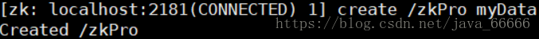
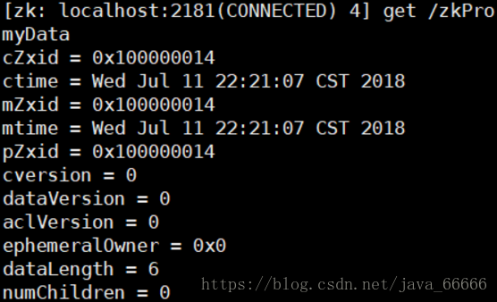
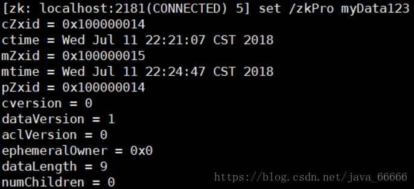
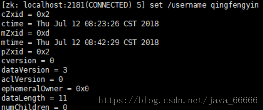
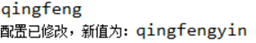

[TOC]
# Zookeeper是什么
官方文档上这么解释zookeeper，它是一个分布式服务框架，是Apache Hadoop 的一个子项目，

它主要是用来解决分布式应用中经常遇到的一些数据管理问题，如：
* 统一命名服务
* 状态同步服务
* 集群管理
* 分布式应用配置项的管理等。

简单来说zookeeper=文件系统+监听通知机制。

## 1. 文件系统

Zookeeper维护一个类似文件系统的数据结构：


每个子目录项如 NameService 都被称作为 znode(目录节点)，和文件系统一样，我们能够自由的增加、删除znode，在一个znode下增加、删除子znode，唯一的不同在于znode是可以存储数据的。


有四种类型的znode：
* **PERSISTENT-持久化目录节点**，客户端与zookeeper断开连接后，该节点依旧存在

* **PERSISTENT_SEQUENTIAL-持久化顺序编号目**录, 节点客户端与zookeeper断开连接后，该节点依旧存在，只是Zookeeper给该节点名称进行顺序编号

* **EPHEMERAL-临时目录节点**，客户端与zookeeper断开连接后，该节点被删除

* **EPHEMERAL_SEQUENTIAL-临时顺序编号目录节点**，客户端与zookeeper断开连接后，该节点被删除，只是Zookeeper给该节点名称进行顺序编号

## 2. 监听通知机制

客户端注册监听它关心的目录节点，当目录节点发生变化（数据改变、被删除、子目录节点增加删除）时，zookeeper会通知客户端。

# Zookeeper能做什么

zookeeper功能非常强大，可以实现诸如分布式应用配置管理、统一命名服务、状态同步服务、集群管理等功能，我们这里拿比较简单的分布式应用配置管理为例来说明。

假设我们的程序是分布式部署在多台机器上，如果我们要改变程序的配置文件，需要逐台机器去修改，非常麻烦，现在把这些配置全部放到zookeeper上去，保存在 zookeeper 的某个目录节点中，然后所有相关应用程序对这个目录节点进行监听，一旦配置信息发生变化，每个应用程序就会收到 zookeeper 的通知，然后从 zookeeper 获取新的配置信息应用到系统中。


# Zookeeper单机模式安装

1. 配置JAVA环境，检验环境：java -version。

2. 下载并解压zookeeper
```shell
# cd /usr/local
# wget http://mirror.bit.edu.cn/apache/zookeeper/stable/zookeeper-3.4.12.tar.gz
# tar -zxvf zookeeper-3.4.12.tar.gz
# cd zookeeper-3.4.12
```

3. 重命名配置文件zoo_sample.cfg
```shell
# cp conf/zoo_sample.cfg conf/zoo.cfg
```
```shell
# 通信心跳数，Zookeeper 服务器与客户端心跳时间，单位毫秒
# Zookeeper 使用的基本时间，服务器之间或客户端与服务器之间维持心跳的时间间隔，也就是每个 tickTime 时间就会发送一个心跳，时间单位为毫秒。
# 它用于心跳机制，并且设置最小的 session 超时时间为两倍心跳时间。(session 的最小超时时间是 2*tickTime)
tickTime=2000

# LF 初始通信时限
# 集群中的 Follower 跟随者服务器与 Leader 领导者服务器之间初始连接时能容忍的最多心跳数（tickTime 的数量），用它来限定集群中的 Zookeeper 服务器连接到 Leader 的时限。
initLimit=10

# LF 同步通信时限
# 集群中 Leader 与 Follower 之间的最大响应时间单位，假如响应超过 syncLimit * tickTime，Leader 认为 Follwer 死掉，从服务器列表中删除 Follwer。
syncLimit=5

# 数据文件目录+数据持久化路径，主要用于保存Zookeeper中的数据。
dataDir=/tmp/zookeeper

# 客户端连接端口，监听客户端连接的端口。
clientPort=2181

# 将事务日志写入 dataLogDir 而不是 dataDir
dataLogDir=/tmp/zookeeper/log
```

4. 启动zookeeper
```shell
# bin/zkServer.sh start
```
5. 检测是否成功启动，用zookeeper客户端连接下服务端
```shell
# bin/zkCli.sh
```

# Zookeeper使用

## 1. 使用客户端命令操作zookeepe

1. 使用 ls 命令来查看当前 ZooKeeper 中所包含的内容 , `ls -s / `可查看详情


2. 创建一个新的 znode ，使用 create /zkPro myData


3. 再次使用 ls 命令来查看现在 zookeeper 中所包含的内容：


4. 下面我们运行 get 命令来确认第二步中所创建的 znode 是否包含我们所创建的字符串：
 

5. 下面我们通过 set 命令来对 zk 所关联的字符串进行设置：
 
6. 下面我们将刚才创建的 znode 删除

## 2. 使用Java API操作zookeeper

使用Java API操作zookeeper需要引用下面的包
```xml
 <dependency>
        <groupId>org.apache.zookeeper</groupId>
        <artifactId>zookeeper</artifactId>
        <version>3.5.7</version>
  </dependency>
```

下面我们来实现上面说的分布式配置中心：
1. 在zookeeper里增加一个目录节点，并且把配置信息存储在里面


2. 启动两个zookeeper客户端程序，代码如下所示
```java
import java.util.concurrent.CountDownLatch;
import org.apache.zookeeper.WatchedEvent;
import org.apache.zookeeper.Watcher;
import org.apache.zookeeper.Watcher.Event.EventType;
import org.apache.zookeeper.Watcher.Event.KeeperState;
import org.apache.zookeeper.ZooKeeper;
import org.apache.zookeeper.data.Stat;
 
/**
 * 分布式配置中心demo
 * @author 
 *
 */
public class ZooKeeperProSync implements Watcher {
 
    private static CountDownLatch connectedSemaphore = new CountDownLatch(1);
    private static ZooKeeper zk = null;
    private static Stat stat = new Stat();
 
    public static void main(String[] args) throws Exception {
        //zookeeper配置数据存放路径
        String path = "/username";
        //连接zookeeper并且注册一个默认的监听器
        zk = new ZooKeeper("192.168.31.100:2181", 5000, //
                new ZooKeeperProSync());
        //等待zk连接成功的通知
        connectedSemaphore.await();
        //获取path目录节点的配置数据，并注册默认的监听器
        System.out.println(new String(zk.getData(path, true, stat)));
 
        Thread.sleep(Integer.MAX_VALUE);
    }
 
    public void process(WatchedEvent event) {
        if (KeeperState.SyncConnected == event.getState()) {  //zk连接成功通知事件
            if (EventType.None == event.getType() && null == event.getPath()) {
                connectedSemaphore.countDown();
            } else if (event.getType() == EventType.NodeDataChanged) {  //zk目录节点数据变化通知事件
                try {
                    System.out.println("配置已修改，新值为：" + new String(zk.getData(event.getPath(), true, stat)));
                } catch (Exception e) {
                }
            }
        }
    }
}
```
两个程序启动后都正确的读取到了zookeeper的/username目录节点下的数据'qingfeng'。

3. 我们在zookeeper里修改下目录节点/username下的数据
 

4. 修改完成后，我们看见两个程序后台都及时收到了他们监听的目录节点数据变更后的值，如下所示


# Zookeeper集群模式安装