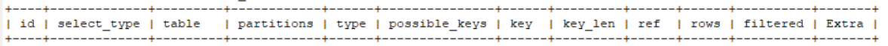

[TOC]

# Explain有什么用

MySQL解释了它将如何处理该语句，包括:

* 表的加载顺序

* sql 的查询类型

* 可能用到哪些索引，哪些索引又被实际使用

* 表与表之间的引用关系

* 一个表中有多少行被优化器查询

* .....

# Explain有哪些信息
Explain 执行计划包含字段信息如下：分别是 `id、select_type、table、partitions、type、possible_keys、key、key_len、ref、rows、filtered、Extra` 12个字段。



我们创建三张表 one、two、three，表之间的关系 one.two_id = two.two_id AND two.three_id = three.three_id。

# Explain执行计划详解

## 一、id
id： ：表示查询中执行select子句或者操作表的顺序，**id的值越大，代表优先级越高，越先执行**。 id大致会出现 3种情况：

### 1. id相同:执行顺序由上而下
看到三条记录的id都相同，可以理解成这三个表为一组，具有同样的优先级，执行顺序由上而下，具体顺序由优化器决定。
```sql
EXPLAIN SELECT * FROM one o,two t, three r WHERE o.two_id = t.two_id AND t.three_id = r.three_id;
```
|id|select_type|table|partitions|type|possible_keys|key|key_len|ref|rows|filtered|Extra|
| --- | --- | --- | --- | --- | --- | --- | --- | --- | --- | --- | --- |
|1|SIMPLE|o|NULL|ALL|NULL|NULL|NULL|NULL|2|100|NULL|
|1|SIMPLE|t|NULL|ALL|PRIMARY|NULL|NULL|NULL|2|50|Using where; Using joinbuffer(BlockNestedLoop)|
|1|SIMPLE|r|NULL|eq_ref|PRIMARY|PRIMARY|4|xin-slave.t.three_id|1|100|NULL


### 2. id不同:id值越大优先级越高，越先被执行
如果我们的 SQL 中存在子查询，那么 id的序号会递增，id值越大优先级越高，越先被执行 。当三个表依次嵌套，发现**最里层的子查询 id最大**，最先执行。

```sql
EXPLAIN select * from one o where o.two_id = (select t.two_id from two t where t.three_id = (select r.three_id  from three r where r.three_name='我是第三表2'));

```
|id|select_type|table|partitions|type|possible_keys|key|key_len|ref|rows|filtered|Extra|
| --- | --- | --- | --- | --- | --- | --- | --- | --- | --- | --- | --- |
|1|PRIMARY|o|NULL|ALL|NULL|NULL|NULL|NULL|2|50|Using where|
|2|SUBQUERY|t|NULL|ALL|NULL|NULL|NULL|NULL|2|50|Using where|
|3|SUBQUERY|r|NULL|ALL|NULL|NULL|NULL|NULL|2|50|Using where|

### 3. 以上两种同时存在

将上边的 SQL 稍微修改一下，增加一个子查询，发现 id的以上两种同时存在。相同id划分为一组，这样就有三个组，同组的从上往下顺序执行，不同组 id值越大，优先级越高，越先执行。

```sql
EXPLAIN select * from one o where o.two_id = (select t.two_id from two t where t.three_id = (select r.three_id  from three r where r.three_name='我是第三表2')) AND o.one_id in(select one_id from one where o.one_name="我是第一表2");
```
|id|select_type|table|partitions|type|possible_keys|key|key_len|ref|rows|filtered|Extra|
| --- | --- | --- | --- | --- | --- | --- | --- | --- | --- | --- | --- |
|1|PRIMARY|o|NULL|ALL|PRIMARY|NULL|NULL|NULL|2|50|Using where|
|1|PRIMARY|one|NULL|eq_ref|PRIMARY|PRIMARY|4|xin-slave.o.one_id|1|100|Using index|
|2|SUBQUERY|t|NULL|ALL|NULL|NULL|NULL|NULL|2|50|Using where|
|3|SUBQUERY|r|NULL|ALL|NULL|NULL|NULL|NULL|2|50|Using where|

## 二、select_type
select_type：表示 select 查询的类型，主要是用于区分各种复杂的查询，例如：普通查询、联合查询、子查询等。

### 1、SIMPLE
SIMPLE：表示最简单的 select 查询语句，也就是在查询中不包含子查询或者 union交并差集等操作。
### 2、PRIMARY
PRIMARY：当查询语句中包含任何复杂的子部分，最外层查询则被标记为PRIMARY。
### 3、SUBQUERY
SUBQUERY：当 select 或 where 列表中包含了子查询，该子查询被标记为：SUBQUERY 。
### 4、DERIVED
DERIVED：表示包含在from子句中的子查询的select，在我们的 from 列表中包含的子查询会被标记为derived 。
### 5、UNION
UNION：如果union后边又出现的select 语句，则会被标记为union；若 union 包含在 from 子句的子查询中，外层 select 将被标记为 derived。
### 6、UNION RESULT
UNION RESULT：代表从union的临时表中读取数据，而table列的<union1,4>表示用第一个和第四个select的结果进行union操作。
```sql
EXPLAIN select t.two_name, ( select one.one_id from one) o from (select two_id,two_name from two where two_name ='') t  union (select r.three_name,r.three_id from three r);
```
|id|select_type|table|partitions|type|possible_keys|key|key_len|ref|rows|filtered|Extra|
| --- | --- | --- | --- | --- | --- | --- | --- | --- | --- | --- | --- |
|1|PRIMARY|two|NULL|ALL|NULL|NULL|NULL|NULL|2|50|Using  where|
|2|SUBQUERY|one|NULL|index|NULL|PRIMARY|4|NULL|2|100|Using index|
|4|UNION|r|NULL|ALL|NULL|NULL|NULL|NULL|2|100|NULL|
|NULL|UNIONRESULT|<union1,4>|NULL|ALL|NULL|NULL|NULL|NULL|NULL|NULL|Using temporary|

## 三、table

查询的表名，并不一定是真实存在的表，有别名显示别名，也可能为临时表，例如上边的DERIVED、 <union1,4>等。

## 四、partitions

查询时匹配到的分区信息，对于非分区表值为NULL，当查询的是分区表时，partitions显示分区表命中的分区情况。

|id|select_type|table|partitions|type|possible_keys|key|key_len|ref|rows|filtered|Extra|
| --- | --- | --- | --- | --- | --- | --- | --- | --- | --- | --- | --- |
|  1 | SIMPLE      | one            | p201801,p201802,p201803,p300012 | index | NULL          | PRIMARY | 9       | NULL |    3 |      100 | Using index |


## 五、type

type：查询使用了何种类型，它在 SQL优化中是一个非常重要的指标，以下性能从好到坏依次是：`system  > const > eq_ref > ref  > ref_or_null > index_merge > unique_subquery > index_subquery > range > index > ALL`

一般来说,好的sql查询至少达到range级别,最好能达到ref 

### 1、system
system： 当表仅有一行记录时(系统表)，数据量很少，往往不需要进行磁盘IO，速度非常快。

### 2、const
const：当MySQL对查询部分进行优化，并转换为一个常量时。这类扫描效率极高，返回数据量少，速度非常快。

```sql
EXPLAIN SELECT * from three where three_id=1;
```
|id|select_type|table|partitions|type|possible_keys|key|key_len|ref|rows|filtered|Extra|
| --- | --- | --- | --- | --- | --- | --- | --- | --- | --- | --- | --- |
|  1 | SIMPLE      | three | NULL       | const | PRIMARY       | PRIMARY | 4       | const |    1 |      100 | NULL  |

### 3、eq_ref
eq_ref：查询时命中主键primary key 或者 unique key索引， type 就是 eq_ref。简单来说，就是多表连接中使用primary key或者 unique key作为关联条件

```sql
EXPLAIN select o.one_name from one o ,two t where o.one_id = t.two_id ; 
```
|id|select_type|table|partitions|type|possible_keys|key|key_len|ref|rows|filtered|Extra|
| --- | --- | --- | --- | --- | --- | --- | --- | --- | --- | --- | --- |
|  1 | SIMPLE      | o     | NULL       | index  | PRIMARY       | idx_name | 768     | NULL               |    2 |      100 | Using index |
|  1 | SIMPLE      | t     | NULL       | eq_ref | PRIMARY       | PRIMARY  | 4       | xin-slave.o.one_id |    1 |      100 | Using index |

### 4、ref
区别于eq_ref ，ref表示使用非唯一性索引，会找到很多个符合条件的行。

```sql
select o.one_id from one o where o.one_name = "xin" ; 
```

| one_id |
| --- |
|  1| 
|  3| 


```sql
EXPLAIN select o.one_id from one o where o.one_name = "xin" ; 
```
|id|select_type|table|partitions|type|possible_keys|key|key_len|ref|rows|filtered|Extra|
| --- | --- | --- | --- | --- | --- | --- | --- | --- | --- | --- | --- |
|  1 | SIMPLE      | o     | NULL       | ref  | idx_name      | idx_name | 768     | const |    1 |      100 | Using index |

### 5、ref_or_null
这种连接类型类似于 ref，区别在于 MySQL会额外搜索包含NULL值的行。

```sql
EXPLAIN select o.one_id from one o where o.one_name = "xin" OR o.one_name IS NULL; 
```
|id|select_type|table|partitions|type|possible_keys|key|key_len|ref|rows|filtered|Extra|
| --- | --- | --- | --- | --- | --- | --- | --- | --- | --- | --- | --- |
|  1 | SIMPLE      | o     | NULL       | ref_or_null | idx_name      | idx_name | 768     | const |    3 |      100 | Using where; Using index |

### 6、index_merge
使用了索引合并优化方法，查询使用了两个以上的索引。

下边示例中同时使用到主键one_id 和 字段one_name的idx_name 索引 。

```sql
EXPLAIN select * from one o where o.one_id >1 and o.one_name ='xin';
```

|id|select_type|table|partitions|type|possible_keys|key|key_len|ref|rows|filtered|Extra|
| --- | --- | --- | --- | --- | --- | --- | --- | --- | --- | --- | --- |
|  1 | SIMPLE      | o     | NULL       | index_merge | PRIMARY,idx_name | idx_name,PRIMARY | 772,4   | NULL |    1 |      100 | Using intersect(idx_name,PRIMARY); Using where |


### 7、unique_subquery和index_subquery
unique_subquery：IN子查询，子查询返回不重复的集合
```sql
value IN (SELECT primary_key FROM single_table WHERE some_expr)
```

index_subquery：区别于unique_subquery，用于非唯一索引，可以返回重复值。

```sql
value IN (SELECT key_column FROM single_table WHERE some_expr)
```

### 8、range
针对一个有索引的字段，给定范围检索数据。在where语句中使用 bettween...and、<、>、<=、in 等条件查询 type 都是 range。在where语句中使用 bettween...and、<、>、<=、in 等条件查询 type 都是 range。

举个栗子：three表中three_id为唯一主键，user_id普通字段未建索引

```sql
EXPLAIN SELECT * from three where three_id BETWEEN 2 AND 3;
```

|id|select_type|table|partitions|type|possible_keys|key|key_len|ref|rows|filtered|Extra|
| --- | --- | --- | --- | --- | --- | --- | --- | --- | --- | --- | --- |
|  1 | SIMPLE      | three | NULL       | range | PRIMARY       | PRIMARY | 4       | NULL |    1 |      100 | Using where |


```sql
EXPLAIN SELECT * from three where user_id BETWEEN 2 AND 3;
```

|id|select_type|table|partitions|type|possible_keys|key|key_len|ref|rows|filtered|Extra|
| --- | --- | --- | --- | --- | --- | --- | --- | --- | --- | --- | --- |
|  1 | SIMPLE      | three | NULL       | ALL  | NULL          | NULL | NULL    | NULL |    3 |    33.33 | Using where |
从结果中看到只有对设置了索引的字段，做范围检索 type 才是 range。

### 9、 index与ALL

Index 与ALL 其实都是读全表，区别在于index是遍历索引树读取，而ALL是从硬盘中读取。

下边示例：three_id 为主键，不带 where 条件全表查询 ，type结果为index

```sql
EXPLAIN SELECT three_id from three ;
```

|id|select_type|table|partitions|type|possible_keys|key|key_len|ref|rows|filtered|Extra|
| --- | --- | --- | --- | --- | --- | --- | --- | --- | --- | --- | --- |
|  1 | SIMPLE      | three | NULL       | index | NULL          | PRIMARY | 4       | NULL |    1 |      100 | Using index |


```sql
EXPLAIN SELECT * from two ;
```

|id|select_type|table|partitions|type|possible_keys|key|key_len|ref|rows|filtered|Extra|
| --- | --- | --- | --- | --- | --- | --- | --- | --- | --- | --- | --- |
|  1 | SIMPLE      | two   | NULL       | ALL  | NULL          | NULL | NULL    | NULL |    2 |      100 | NULL  |

## 六、possible_keys

表示在MySQL中通过哪些索引，能让我们在表中找到想要的记录，**一旦查询涉及到的某个字段上存在索引，则索引将被列出，但这个索引并不定一会是最终查询数据时所被用到的索引。**

## 七、key

区别于possible_keys，key是查询中实际使用到的索引，若没有使用索引，显示为NULL

当 type 为 index_merge 时，可能会显示多个索引。

## 八、key_len
表示查询用到的索引长度（字节数），原则上长度越短越好 。

* 单列索引，那么需要将整个索引长度算进去；

* 多列索引，不是所有列都能用到，需要计算查询中实际用到的列。

>注意：key_len只计算where条件中用到的索引长度，而排序和分组即便是用到了索引，也不会计算到key_len中。

## 九、ref
常见的有：const，func，null，字段名。

* 当使用常量等值查询，显示const，

* 当关联查询时，会显示相应关联表的关联字段

* 如果查询条件使用了表达式、函数，或者条件列发生内部隐式转换，可能显示为func

* 其他情况null

## 十、rows
以表的统计信息和索引使用情况，估算要找到我们所需的记录，需要读取的行数。

这是评估SQL 性能的一个比较重要的数据，mysql需要扫描的行数，很直观的显示 SQL 性能的好坏，一般情况下 rows 值越小越好。


```sql
EXPLAIN SELECT * from three;
```

|id|select_type|table|partitions|type|possible_keys|key|key_len|ref|rows|filtered|Extra|
| --- | --- | --- | --- | --- | --- | --- | --- | --- | --- | --- | --- |
|  1 | SIMPLE      | three | NULL       | ALL  | NULL          | NULL | NULL    | NULL |    3 |      100 | NULL  |

## 十一、filtered

这个是一个百分比的值，表里符合条件的记录数的百分比。简单点说，这个字段表示存储引擎返回的数据在经过过滤后，剩下满足条件的记录数量的比例。
在MySQL.5.7版本以前想要显示filtered需要使用explain extended命令。MySQL.5.7后，默认explain直接显示partitions和filtered的信息。

## 十二、Extra
不适合在其他列中显示的信息，Explain 中的很多额外的信息会在 Extra 字段显示。

### 1、Using index
Using index：我们在相应的 select 操作中使用了覆盖索引，通俗一点讲就是查询的列被索引覆盖，使用到覆盖索引不需要回表，查询速度会非常快，SQl优化中理想的状态。

>什么是覆盖索引?
一条 SQL只需要通过索引就可以返回，我们所需要查询的数据（一个或几个字段），而不必通过回表，查到主键之后再通过主键查询整行数据（select * ）。

one_id为表主键
```sql
EXPLAIN SELECT one_id from one ;
```

|id|select_type|table|partitions|type|possible_keys|key|key_len|ref|rows|filtered|Extra|
| --- | --- | --- | --- | --- | --- | --- | --- | --- | --- | --- | --- |
|  1 | SIMPLE      | one   | NULL       | index | NULL          | idx_two_id | 5       | NULL |    3 |      100 | Using index |

注意：想要使用到覆盖索引，我们在 select 时只取出需要的字段，而且该字段建了索引，不可使用`select *，`。
```sql
EXPLAIN SELECT * from one ;
```

|id|select_type|table|partitions|type|possible_keys|key|key_len|ref|rows|filtered|Extra|
| --- | --- | --- | --- | --- | --- | --- | --- | --- | --- | --- | --- |
|  1 | SIMPLE      | one   | NULL       | ALL  | NULL          | NULL | NULL    | NULL |    3 |      100 | NULL  |

### 2、Using where
查询时未找到可用的索引，进而通过where条件过滤获取所需数据，但要注意的是并不是所有带where语句的查询都会显示Using where。

下边示例create_time 并未用到索引，type 为 ALL，即MySQL通过全表扫描后再按where条件筛选数据。

```sql
EXPLAIN SELECT one_name from one where create_time ='2020-05-18';
```

|id|select_type|table|partitions|type|possible_keys|key|key_len|ref|rows|filtered|Extra|
| --- | --- | --- | --- | --- | --- | --- | --- | --- | --- | --- | --- |
|  1 | SIMPLE      | one   | NULL       | ALL  | NULL          | NULL | NULL    | NULL |    3 |    33.33 | Using where |

### 3、Using temporary
表示查询后结果需要使用临时表来存储，一般在排序或者分组查询时用到。

```sql
EXPLAIN SELECT one_name from one where one_id in (1,2) group by one_name;
```

|id|select_type|table|partitions|type|possible_keys|key|key_len|ref|rows|filtered|Extra|
| --- | --- | --- | --- | --- | --- | --- | --- | --- | --- | --- | --- |
|  1 | SIMPLE      | one   | NULL       | range| NULL          | NULL | NULL    | NULL |    3 |    33.33 | Using where; Using temporary; Using filesort |

### 4、Using filesort
表示无法利用索引完成的排序操作，也就是ORDER BY的字段没有索引，通常这样的SQL都是需要优化的。

```sql
EXPLAIN SELECT one_id from one  ORDER BY create_time;
```

|id|select_type|table|partitions|type|possible_keys|key|key_len|ref|rows|filtered|Extra|
| --- | --- | --- | --- | --- | --- | --- | --- | --- | --- | --- | --- |
|  1 | SIMPLE      | one   | NULL       | ALL  | NULL          | NULL | NULL    | NULL |    3 |      100 | Using filesort |

### 5、Using join buffer
在我们联表查询的时候，如果表的连接条件没有用到索引，需要有一个连接缓冲区来存储中间结果。

先看一下有索引的情况：连接条件 one_name 、two_name 都有索引。


```sql
EXPLAIN SELECT one_name from one o,two t where o.one_name = t.two_name;
```

|id|select_type|table|partitions|type|possible_keys|key|key_len|ref|rows|filtered|Extra|
| --- | --- | --- | --- | --- | --- | --- | --- | --- | --- | --- | --- |
|  1 | SIMPLE      | o     | NULL       | index | idx_name      | idx_name | 768     | NULL                 |    3 |      100 | Using where; Using index |
|  1 | SIMPLE      | t     | NULL       | ref   | idx_name      | idx_name | 768     | xin-slave.o.one_name |    1 |      100 | Using index              |
接下来删掉 连接条件 one_name 、two_name 的字段索引。发现Extra 列变成 Using join buffer，type均为全表扫描，这也是SQL优化中需要注意的地方。

|id|select_type|table|partitions|type|possible_keys|key|key_len|ref|rows|filtered|Extra|
| --- | --- | --- | --- | --- | --- | --- | --- | --- | --- | --- | --- |
|  1 | SIMPLE      | t     | NULL       | ALL  | NULL          | NULL | NULL    | NULL |    2 |      100 | NULL                                               |
|  1 | SIMPLE      | o     | NULL       | ALL  | NULL          | NULL | NULL    | NULL |    3 |    33.33 | Using where;Using join buffer (Block Nested Loop) |

### 6、Impossible where

表示在我们用不太正确的where语句，导致没有符合条件的行。


```sql
EXPLAIN SELECT one_name from one WHERE 1=2;
```

|id|select_type|table|partitions|type|possible_keys|key|key_len|ref|rows|filtered|Extra|
| --- | --- | --- | --- | --- | --- | --- | --- | --- | --- | --- | --- |
|  1 | SIMPLE      | NULL  | NULL       | NULL | NULL          | NULL | NULL    | NULL | NULL | NULL     | Impossible WHERE |


### 7、No tables used
我们的查询语句中没有FROM子句，或者有 FROM DUAL子句。


```sql
EXPLAIN select now();
```

|id|select_type|table|partitions|type|possible_keys|key|key_len|ref|rows|filtered|Extra|
| --- | --- | --- | --- | --- | --- | --- | --- | --- | --- | --- | --- |
|  1 | SIMPLE      | NULL  | NULL       | NULL | NULL          | NULL | NULL    | NULL | NULL | NULL     | No tables used |


