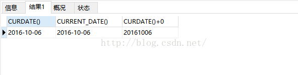
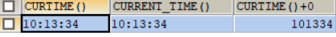
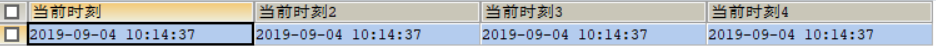
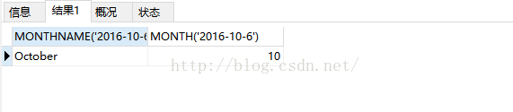
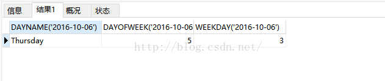
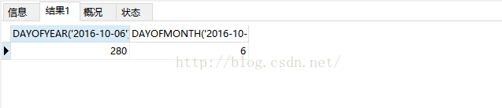
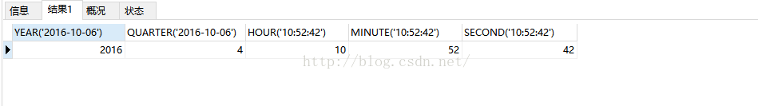
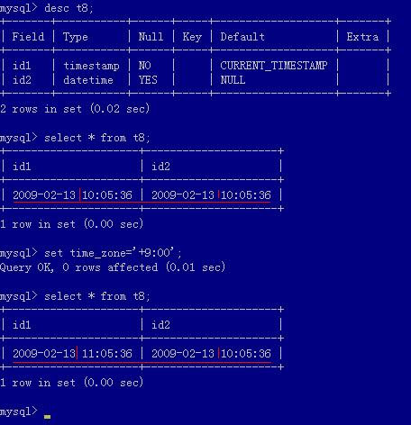

[TOC]

#### 日期格式化
```sql
select DATE_FORMAT('2013-03-09','%Y-%m-%d %H:%i:%S')
```
MySQL的时间格式化符和描述
|格式	| 描述|
| --- | --- |
|%a	|缩写星期名                                    |
|%b	|缩写月名                                      |
|%c	|月，数值                                      |
|%D	|带有英文前缀的月中的天                        |
|%d	|月的天，数值(00-31)                           |
|%e	|月的天，数值(0-31)                            |
|%f	|微秒                                         |
|%H	|小时 (00-23)                                  |
|%h	|小时 (01-12)                                  |
|%I	|小时 (01-12)                                  |
|%i	|分钟，数值(00-59)                             |
|%j	|年的天 (001-366)                              |
|%k	|小时 (0-23)                                   |
|%l	|小时 (1-12)                                   |
|%M	|月名                                          |
|%m	|月，数值(00-12)                               |
|%p	|AM 或 PM                                      |
|%r	|时间，12-小时（hh:mm:ss AM 或 PM）            |
|%S	|秒(00-59)                                     |
|%s	|秒(00-59)                                     |
|%T	|时间, 24-小时 (hh:mm:ss)                      |
|%U	|周 (00-53) 星期日是一周的第一天               |
|%u	|周 (00-53) 星期一是一周的第一天               |
|%V	|周 (01-53) 星期日是一周的第一天，与 %X 使用   |
|%v	|周 (01-53) 星期一是一周的第一天，与 %x 使用   |
|%W	|星期名                                        |
|%w	|周的天 （0=星期日, 6=星期六）                 |
|%X	|年，其中的星期日是周的第一天，4 位，与 %V 使用 |
|%x	|年，其中的星期一是周的第一天，4 位，与 %v 使用 |
|%Y	|年，4 位                                      |
|%y	|年，2 位                                      |


#### 1. 得到当前系统日期的函数
CURDATE()+0可以将当前日期值转换为数值型
```sql
SELECT CURDATE(),CURRENT_DATE(),CURDATE()+0
```



#### 2. 得到当前系统时间的函数

CURTIME()+0将时间转换为秒数
```sql
SELECT CURTIME(),CURRENT_TIME(),CURTIME()+0
```


#### 3. 得到系统当前的日期和时间
```sql
SELECT 
NOW() AS '当前时刻',
SYSDATE() AS '当前时刻2',
LOCALTIME() AS '当前时刻3',
CURRENT_TIMESTAMP() AS '当前时刻4'
```

#### 4. 获取当前系统的月份
```sql
SELECT MONTHNAME('2016-10-6'),MONTH('2016-10-6')
```

#### 5. 获取当前系统的星期
```sql
SELECT DAYNAME('2016-10-06'),DAYOFWEEK('2016-10-06'),WEEKDAY('2016-10-06')
```


分别表示星期名，一周第几天，默认星期一为0天的情况下的计数
##### 6. 获取当前系统的星期在一年中属于第几个星期
```sql
SELECT WEEK('2016-10-06'),WEEKOFYEAR('2016-10-06')
```


#### 7. 获取当前系统日期的天数
```sql
SELECT DAYOFYEAR('2016-10-06'),DAYOFMONTH('2016-10-06')
```


 一年中的第几天，一个月中的第几天
 
 #### 8. 获取年份，季度，小时，分钟，秒钟
 ```sql
SELECT 
YEAR('2016-10-06'),
QUARTER('2016-10-06'),
HOUR('10:52:42'),
MINUTE('10:52:42'),
SECOND('10:52:42')
```


#### 9. 计算两个日期之间的天数

* 利用`TO_DAYS`函数
```sql
select to_days(now()) - to_days('20120512')
```
函数不用于阳历出现(1582)前的值，原因是当日历改变时，遗失的日期不会被考虑在内。因此对于1582 年之前的日期(或许在其它地区为下一年 ), 该函数的结果是不可靠的。

* 利用`DATEDIFF`函数
```sql
select datediff(now(),'20120512')
```
参数1 - 参数2 等于间隔天数

#### 10. TIMESTAMPDIFF函数

* 计算两日期时间之间相差的天数，秒数，分钟数，周数，小时数

* 函数` TimeStampDiff() `是MySQL本身提供的可以计算两个时间间隔的函数，语法为：
` TIMESTAMPDIFF(unit,datetime_expr1,datetime_expr2)`
* 返回日期或日期时间表达式`datetime_expr1` 和`datetime_expr2the` 之间的整数差。其中unit单位有如下几种，分别是：FRAC_SECOND (microseconds), SECOND, MINUTE, HOUR, DAY, WEEK, MONTH, QUARTER, YEAR 。
* 该参数具体释义如下：
    * FRAC_SECOND   表示间隔是毫秒
    * SECOND   秒
    * MINUTE   分钟
    * HOUR   小时
    * DAY   天
    * WEEK   星期
    * MONTH   月
    * QUARTER   季度
    * YEAR   年
示例：

1. 计算两日期之间相差多少周
```sql
select timestampdiff(week,'2011-09-30','2015-05-04');
```
2. 计算两日期之间相差多少天
```sql
select timestampdiff(day,'2011-09-30','2015-05-04');
```
3. 计算两日期/时间之间相差的秒数：
```sql
select timestampdiff(SECOND,'2011-09-30','2015-05-04');
```
另外还可以使用 MySql 内置函数 UNIX_TIMESTAMP 实现，如下：
```sql
SELECT　UNIX_TIMESTAMP(end_time) - UNIX_TIMESTAMP(start_time);　
```
4. 计算两日期/时间之间相差的时分数
```sql
select timestampdiff(MINUTE,'2011-09-30','2015-05-04');
```
#### 11. MySQL中的datetime与timestamp比较

##### 相同
TIMESTAMP列的显示格式与DATETIME列相同。换句话说，显示宽度固定在19字符，并且格式为YYYY-MM-DD HH:MM:SS。

##### 不同
###### 范围
    
  * datetime 以'YYYY-MM-DD HH:MM:SS'格式检索和显示DATETIME值。支持的范围为'1000-01-01 00:00:00'到'9999-12-31 23:59:59'
 * TIMESTAMP值不能早于1970或晚于2037

###### 储存
* TIMESTAMP
 
    1.  4个字节储存（Time stamp value is stored in 4 bytes）
    2. 值以UTC格式保存（ it stores the number of milliseconds）
    3. 时区转化 ，存储时对当前的时区进行转换，检索时再转换回当前的时区。
* datetime
    1. 8个字节储存（8 bytes storage）
    2. 实际格式储存（Just stores what you have stored and retrieves the same thing which you have stored.）
    3. 与时区无关（It has nothing to deal with the TIMEZONE and Conversion.）

#####  实例对比
时区对他们的影响。
1. 先插入一个数据
```sql
 insert into t8 values(now(), now());
```

2. 改变客户端时区（东9区，日本时区）。

3. 再次显示插入的数据，变化了，timestamp类型的数据 增加了 1个小时





