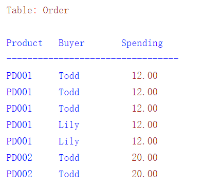
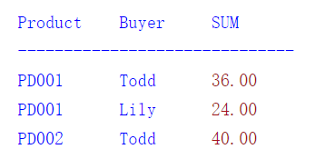
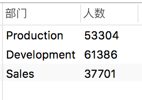
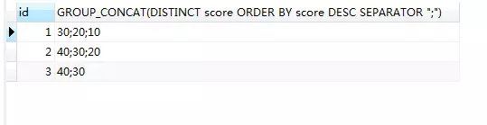

[TOC]

#### 1. 使用SHOW语句找出在服务器上当前存在什么数据库：
```sql
SHOW DATABASES;
```
#### 2. 创建一个数据库MYSQLDATA
```sql
CREATE DATABASE MYSQLDATA;
```
#### 3. 选择你所创建的数据库
```sql
 USE MYSQLDATA; (按回车键出现Database changed 时说明操作成功！)
 ```
 #### 4. 查看现在的数据库中存在什么表
```sql
SHOW TABLES;
```
#### 5. 创建一个数据库表
```sql
CREATE TABLE MYTABLE (name VARCHAR(20), sex CHAR(1));
```
#### 6. 显示表的结构
```sql
DESCRIBE MYTABLE;
```
#### 7. 增
```sql
insert into MYTABLE values (”hyq”,”M”)
```
#### 8. 删
```sql
delete from MYCLASS where id = 1
```
#### 9. 改
```sql
update MYTABLE set sex=”f” where name='hyq'
```
#### 10. 查
```sql
select * from MYTABLE
```
#### 11. 用文本方式将数据装入数据库表中（例如D:/mysql.txt）
```sql
LOAD DATA LOCAL INFILE “D:/mysql.txt” INTO TABLE MYTABLE
```
#### 12. 导入.sql文件命令（例如D:/mysql.sql）
```sql
use database;
source d:/mysql.sql;
```
#### 13. 删除表
```sql
drop TABLE MYTABLE
```
#### 14. 清空表
```sql
delete from MYTABLE where test='test' -- 删除部分数据
或
truncate  table MYTABLE -- 清空表
```
#### 15. limit的用法
```sql
select * from tableName limit i,n 
--  tableName：表名 
-- i：为查询结果的索引值(默认从0开始)，当i=0时可省略i 
-- n：为查询结果返回的数量 
-- i与n之间使用英文逗号","隔开 
-- limit n 等同于 limit 0,n
```
示例：
```sql
--  查询10条数据，索引从0到9，第1条记录到第10条记录
select * from t_user limit 10;
select * from t_user limit 0,10;

--  查询8条数据，索引从5到12，第6条记录到第13条记录
select * from t_user limit 5,8;
```
#### 16. 批量删除process

**查看数据库中所有进程**

```sql

show processlist; 
```
**连接kill与进程ID**

```sql
select concat('KILL ',id,';') from information_schema.processlist where user='root'and db = 'onlineshow';
```
结果：
```sql
+------------------------+
| concat('KILL ',id,';') 
+------------------------+
| KILL 3101;             
| KILL 2946;             
+------------------------+
2 rows in set (0.00 sec)

```
**执行结果命令**

#### 17. MySql中IS NOT NULL与!=NULL的区别

在mysql中，筛选非空的时候经常会用到 `is not null`和`!=null`，这两种方法单从字面上来看感觉是差不多的，其实如果去运行一下试试的话差别会很大！
**为什么会出现这种情况呢？**

* null 表示什么也不是， 不能=、>、< … 所有的判断，结果都是false，所有只能用 is null进行判断。

* 默认情况下，推荐使用 `IS NOT NULL`去判断，因为SQL默认情况下对`！= Null`的判断会永远返回0行，但没有语法错误。

* 如果你一定想要使用！= Null来判断，需要加上这个语句：`set ANSI_NULLS off`
这时你会发现IS NOT NULL 和 != null 是等效的。

#### 18. MySQL 中 IFNULL() 的作用

```sql
SELECT IFNULL(x, y)
```

* 如果返回的数据记录里面 x 不是 NULL (不包含0)，IFNULL() 返回 x，否則它返回 y。

* 如果查询的 id 值在数据库中不存在，所以并没有返回记录，IFNULL() 也不会起作用。至于没有返回记录时给一个默认值，建议在程序上实现。

#### 19 . mysql中case when 语法

* 简单Case函数
```sql
CASE sex
WHEN '1' THEN '男'
WHEN '2' THEN '女'
ELSE '其他' END
```
* Case搜索函数 
```sql
CASE WHEN sex = '1' THEN '男' 
WHEN sex = '2' THEN '女' 
ELSE '其他' END  
```
* Case函数只返回第一个符合条件的值，剩下的Case部分将会被自动忽略。

比如说，下面这段SQL，你永远无法得到“第二类”这个结果 
```sql
CASE WHEN col_1 IN ( 'a', 'b') THEN '第一类' 
WHEN col_1 IN ('a')  THEN '第二类' 
ELSE'其他' END
```
#### 20. mysql格式化小数保留小数点位数


1. round(x,d) :用于数据的四舍五入.
    * round(x)  ,其实就是round(x,0),也就是默认d为0；
    * 这里有个值得注意的地方是，d可以是负数，这时是指定小数点左边的d位整数位为0,同时小数位均为0；
```sql
    SELECT ROUND(100.3465,2),ROUND(100,2),ROUND(0.6,2),ROUND(114.6,-1);
--   结果分别：100.35,100，0.6,110 
```
    
2. TRUNCATE(x,d)：函数返回被舍去至小数点后d位的数字x。
    * 若d的值为0，则结果不带有小数点或不带有小数部分。
    * 若d设为负数，则截去（归零）x小数点左起第d位开始后面所有低位的值。
 ```sql
    SELECT TRUNCATE(100.3465,2),TRUNCATE(100,2),TRUNCATE(0.6,2),TRUNCATE(114.6,-1);
    -- 结果分别：100.34,100，0.6,110 
```

3. FORMAT（X,D）：强制保留D位小数，整数部分超过三位的时候以逗号分割，并且返回的结果是string类型的　
```sql
SELECT FORMAT(100.3465,2),FORMAT(100,2),FORMAT(,100.6,2);
-- 结果分别：100.35,100.00，100.60 
```

4. convert（value，type):类型转换，相当于截取
    type:
    * 二进制，同带binary前缀的效果 : BINARY    
    * 字符型，可带参数 : CHAR()     
    * 日期 : DATE     
    * 时间: TIME    
    * 日期时间型 : DATETIME     
    * 浮点数 : DECIMAL     
    * 整数 : SIGNED    
    * 无符号整数 : UNSIGNED 
  ```sql
SELECT CONVERT(100.3465,DECIMAL(10,2)), 
CONVERT(100,DECIMAL(10,2)),
CONVERT(100.4,DECIMAL(10,2));
-- 结果分别：100.35,100，100.4
```
#### 21. sql查询重复记录、删除重复记录

1. 查找全部重复记录
```sql
Select * From 表 Where 重复字段 In (Select 重复字段 From 表 Group By 重复字段 Having Count(*)>1)
```

2. 过滤重复记录(只显示一条),此处显示ID最大一条记录
```sql
Select * From HZT Where ID In (Select Max(ID) From HZT Group By Title)
```

3. 删除全部重复记录（慎用） 
```sql
Delete 表 Where 重复字段 In (Select 重复字段 From 表 Group By 重复字段 Having Count(*)>1)
```
4. 保留一条（这个应该是大多数人所需要的）
```sql
Delete HZT Where ID Not In (Select Max(ID) From HZT Group By Title)
```

#### 22. group by 多个字段

* GROUP BY X意思是将所有具有相同X字段值的记录放到一个分组里
* GROUP BY X, Y意思是将所有具有相同X字段值和Y字段值的记录放到一个分组里。
* 示例


    现在我们想统计每个用户在每种商品上总共花了多少钱，执行如下SQL：
 ```sql
SELECT Product，Buyer, SUM(Spending)
FROM `Order`GROUP BY Product, Buyer
```

获得的结果如下：


#### 23. having
* HAVING相当于条件筛选，但它与WHERE筛选不同
* HAVING是对于GROUP BY对象进行筛选

我们举个例子：
每个部门人数都有了，那如果我们想要进一步知道员工人数大于30000的部门是哪些，这个时候就得用到HAVING了。
语句如下：
```sql
SELECT
    ( SELECT d.dept_name FROM departments d WHERE de.dept_no = d.dept_no ) AS 部门,
    count( de.emp_no ) AS 人数 
FROM
    dept_emp de 
WHERE
    de.to_date = '9999-01-01' 
GROUP BY
    de.dept_no 
HAVING
    count( de.emp_no ) > 30000 
```
结果：



#### 24. group_concat函数

完整的语法如下： 
> group_concat([DISTINCT] 要连接的字段 [Order BY ASC/DESC 排序字段] [Separator '分隔符']) 

示例：
```sql

SELECT id,GROUP_CONCAT(DISTINCT score ORDER BY score DESC SEPARATOR ";") from score GROUP BY id;
```


GROUP_CONCAT将某一字段的值按指定的字符进行累加，系统默认的分隔符是逗号，可以累加的字符长度为1024字节。可以对这些参数进行修改。

1. 先举一个简单的例子
```sql
   select group_concat(f_a) from t_one group by f_b;
```
按f_b进行分组查询，将每组中的f_a进行累加。
  
2. 修改默认的分隔符
```sql
select group_concat(f_a  separator  '_') from t_one group by f_b;
   -- separator  是一个关键字，后面跟着要进行分隔的字符
```
3. 排序
```sql
   select group_concat(f_a order by f_a  separator  '_') from t_one group by f_b;
```
4. 修改默认字符大小
   1).在MySQL配置文件中加上
        group_concat_max_len = 102400 #你要的最大长度
    2).可以简单一点，执行语句,可以设置作用范围
      ```
        SET GLOBAL group_concat_max_len=102400;
        SET SESSION group_concat_max_len=102400;
       ```
  
  #### 25. mysql启动和关闭外键约束的方法
  
  在MySQL中删除一张表或一条数据的时候，出现
```
[Err] 1451 -Cannot delete or update a parent row: a foreign key constraint fails (...)
```
* 这是因为MySQL中设置了foreign key关联，造成无法更新或删除数据。可以通过设置FOREIGN_KEY_CHECKS变量来避免这种情况。

* 我们可以使用
```
    SET FOREIGN_KEY_CHECKS=0;
 ```
    
来禁用外键约束。之后再用
```
    SET FOREIGN_KEY_CHECKS=1;
 ```
来启动外键约束.
 
查看当前FOREIGN_KEY_CHECKS的值可用如下命令

```
    SELECT  @@FOREIGN_KEY_CHECKS;
 ```

  
  


