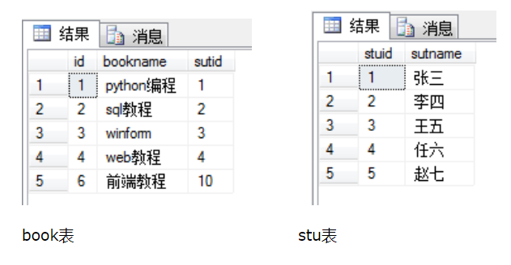
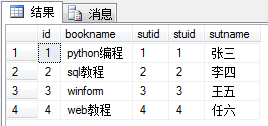
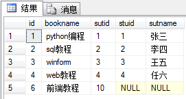
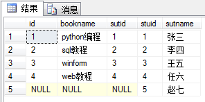
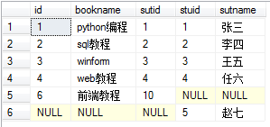
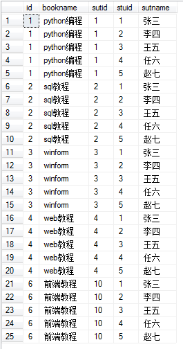

**SQL连接可以分为内连接、外连接、交叉连接。**


**数据库数据：**



## 1.内连接

内连接查询操作列出与连接条件匹配的数据行，它使用比较运算符比较被连接列的列值。
### 隐式的内连接
没有INNER JOIN，形成的中间表为两个表的**笛卡尔积**。
```sql

select * from book as a,stu as b where a.sutid = b.stuid

select * from book as a inner join stu as b on a.sutid = b.stuid
```

内连接可以使用上面两种方式，其中第二种方式的inner可以省略。


其连接结果如上图，是按照a.stuid = b.stuid进行连接。

### 显式的内连接
一般称为内连接，有INNER JOIN，形成的中间表为两个表经过ON条件过滤后的**笛卡尔积**。

```sql
SELECT O.ID,O.ORDER_NUMBER,C.ID,C.NAMEFROM CUSTOMERS C INNER JOIN ORDERS O ON C.ID=O.CUSTOMER_ID;
```


## 2.外连接

### 2.1 左联接

以左表为基准，将a.stuid = b.stuid的数据进行连接，然后将左表没有的对应项显示，右表的列为NULL

```sql

select * from book as a left join stu as b on a.sutid = b.stuid
```


### 2.2.右连接
以右表为基准，将a.stuid = b.stuid的数据进行连接，然以将右表没有的对应项显示，左表的列为NULL
```sql
select * from book as a right join stu as b on a.sutid = b.stuid
```


### 2.3.全连接
完整外部联接返回左表和右表中的所有行。当某行在另一个表中没有匹配行时，则另一个表的选择列表列包含空值。如果表之间有匹配行，则整个结果集行包含基表的数据值。
```sql
select * from book as a full outer join stu as b on a.sutid = b.stuid
```


## 3.交叉连接

交叉连接：交叉联接返回左表中的所有行，左表中的每一行与右表中的所有行组合。

有两种，显式的和隐式的，不带ON子句，返回的是两表的乘积，也叫笛卡尔积。。

### 隐式的交叉连接,没有CROSS JOIN
```sql
SELECT O.ID, O.ORDER_NUMBER, C.ID, C.NAMEFROM ORDERS O , CUSTOMERS CWHERE O.ID=1;
```
### 显式的交叉连接，使用CROSS JOIN
```sql
select * from book as a cross join stu as b order by a.id
```


