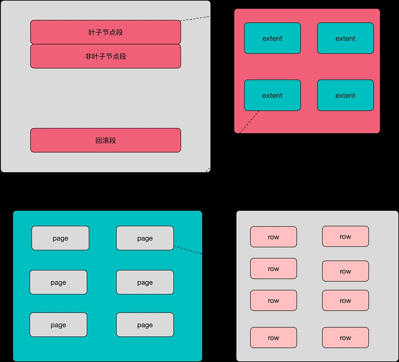
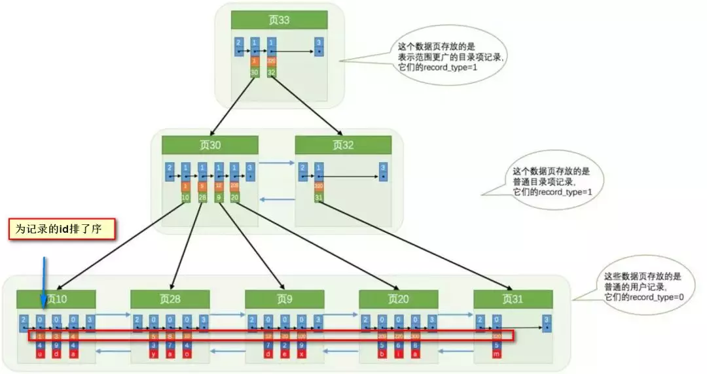
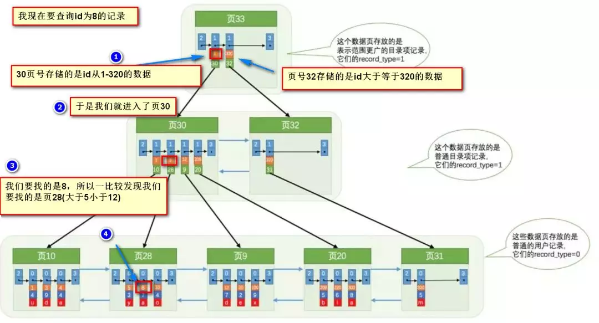
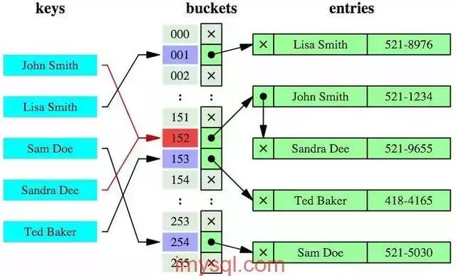
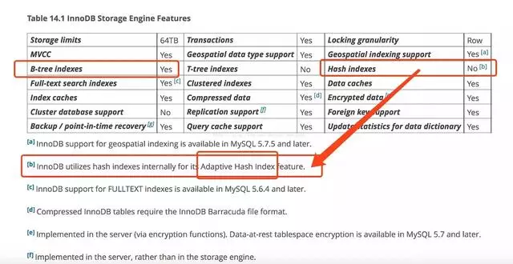

[TOC]
# 索引的基础知识

在 InnoDB 存储引擎中，所有的数据都被逻辑地存放在表空间中，表空间(tablespace)是存储引擎中最高的存储逻辑单位，在表空间的下面又包括段(segment)、区(extent)、页(page)：

## 表空间

### 段 segment
由上图可知表空间由各个段组成，常见的段由数据段，索引段，回滚段等，其中数据段即为B+树的叶子节点，索引段即为B+树的非叶子节点，回滚段用于存储undo日志，用于事务失败后数据回滚以及在事务未提交之前通过undo日志获取之前版本的数据，在InnoDB1.1版本之前一个InnoDB,只支持一个回滚段，支持1023个并发修改事务同时进行，在InnoDB1.2版本，将回滚段数量提高到了128个，也就是说可以同时进行`128*1023`个并发修改事务。
### 区 extent
区是由连续页组成的空间，在任何情况下每个区的大小都为1MB，当然对于数据表创建伊始，表的默认大小只有96k，区中是连续的64个页，这时满足不了这个条件，其实数据段开始用32个碎片页来组成，使用完这些页之后再开始申请区来存储，为了保证区中页的连续性，Innodb存储引擎一次从磁盘申请4-5个区。

### 页 page
innodb引擎本身是以行的形式存储数据，这意味着每一页存储了一行行的数据，innodb提供了compact与rudundant格式来存储行数据，同一个数据库实例地所有表空间都有相同页地大小，默认情况下，表空间的页大小都为16k，这样区里面就需要连续的64个页来哦填充，当然可以通过改变innodb_page_size参数来进行修改，修改后区里面的页数量也会随之改变。
### 行 row

innodb引擎支持两种行记录格式，分别为Compact 与 Redundant，在此分别简述两种格式；
* Compact：

compact首部是一个非NULL变长字段长度列表，若列的长度小于255个字节，用1字节表示，若大于255字节，用2字节表示，最大不超过2字节，这也是mysql数据库中varchar最大长度限制为65535的原因，之后是个null标识位，行数据中由null的则用1表示，该部分占用1字节，接下来的部分是记录头信息，固定占用5字节。最后的部分是实际存储的每行数据，需要注意的是null不占该部分任何空间，即null除了占有null标志位，实际存储不占用任何空间，另外，每行除了用户定义的数据以外，还有两个隐藏列，事务ID列与回滚指针列，分别位6字节与7字节的大小，若未定义主键，则每行还会生成一个6字节的rowid列。
* Redundant:

两者不同的在于Redundant首部记录的是一个字段长度偏移列表，同样是按照列的顺序逆序放置的，若列的长度小于255个字节，用1字节表示，若大于255字节，用2字节表示，第二个部分是记录头部信息，不同于compact格式，Redundant的记录头占用6字节。

* 各个数据页可以组成一个双向链表；

* 而每个数据页中的记录又可以组成一个单向链表；
* 每个数据页都会为存储在它里边儿的记录生成一个页目录，在通过主键查找某条记录的时候可以在页目录中
使用二分法快速定位到对应的槽，然后再遍历该槽对应分组中的记录即可快速找到指定的记录；

* 以其他列(非主键)作为搜索条件：只能从最小记录开始依次遍历单链表中的每条记录。

所以说，如果我们写`select * from user where username = 'Java3y'`这样没有进行任何优化的sql语句，默认会这样做：
* 定位到记录所在的区
* 需要遍历双向链表，找到所在的页
* 从所在的页内中查找相应的记录
* 由于不是根据主键查询，只能遍历所在页的单链表了

很明显，在数据量很大的情况下这样查找会很慢！

# 索引提高检索速度

索引做了些什么可以让我们查询加快速度呢？

其实就是将无序的数据变成有序(相对)：

要找到id为8的记录简要步骤：

很明显的是：
* 没有用索引我们是需要遍历双向链表来定位对应的页，
* 现在通过"目录"就可以很快地定位到对应的页上了！
* 其实底层结构就是B+树，B+树作为树的一种实现，能够让我们很快地查找出对应的记录。

# 索引降低增删改的速度

如果一棵普通的树在极端的情况下，是能退化成链表的(树的优点就不复存在了)

B+树是平衡树的一种，是不会退化成链表的，树的高度都是相对比较低的(基本符合矮矮胖胖(均衡)的结构)【这样一来我们检索的时间复杂度就是O(logn)】！从上一节的图我们也可以看见，建立索引实际上就是建立一颗B+树。

* B+树是一颗平衡树，如果我们对这颗树增删改的话，那肯定会破坏它的原有结构；

* 要维持平衡树，就必须做额外的工作。正因为这些额外的工作开销，导致索引会降低增删改的速度；

# 哈希索引

除了B+树之外，还有一种常见的是哈希索引。

哈希索引就是采用一定的哈希算法，把键值换算成新的哈希值，检索时不需要类似B+树那样从根节点到叶子节点逐级查找，只需一次哈希算法即可立刻定位到相应的位置，速度非常快。

* 本质上就是把键值换算成新的哈希值，根据这个哈希值来定位。

看起来哈希索引很牛逼啊，但其实哈希索引有好几个局限(根据他本质的原理可得)：
* 哈希索引也没办法利用索引完成排序；
* 不支持最左匹配原则；
* 在有大量重复键值情况下，哈希索引的效率也是极低的---->哈希碰撞问题；
* 不支持范围查询；

# InnoDB支持哈希索引吗？

主流的还是使用B+树索引比较多，对于哈希索引，InnoDB是自适应哈希索引的（hash索引的创建由InnoDB存储引擎引擎自动优化创建，我们干预不了）！

