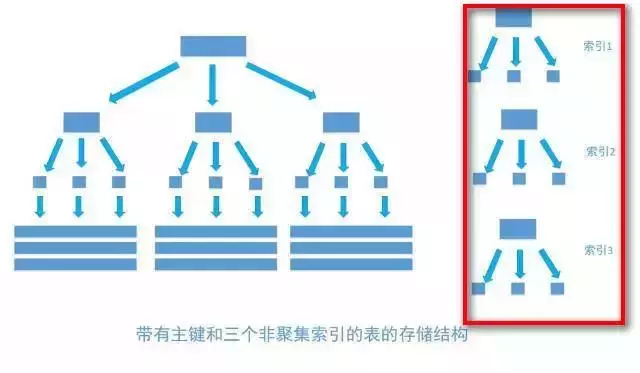

[TOC]
### 1.  从物理存储角度

索引可以分为聚集索引和非聚集索引。

简单概括：

* 聚集索引就是以主键创建的索引；聚集索引决定数据在磁盘上的物理排序，一个表只能有一个聚集索引，一般用primary key来约束。
* 非聚集索引就是以非主键创建的索引；它并不决定数据在磁盘上的物理排序，索引上只包含被建立索引的数据，以及一个行定位符row-locator，这个行定位符，可以理解为一个聚集索引物理排序的指针（**即主键**），通过这个指针，可以找到行数据。

区别：

* 聚集索引在叶子节点存储的是表中的数据；
* 非聚集索引在叶子节点存储的是主键和索引列；
* 使用非聚集索引查询出数据时，拿到叶子上的主键再去查到想要查找的数据。(拿到主键再查找这个过程叫做回表)

非聚集索引也叫做二级索引，不用纠结那么多名词，将其等价就行了~

非聚集索引在建立的时候也未必是单列的，可以多个列来创建索引。

* 此时就涉及到了哪个列会走索引，哪个列不走索引的问题了(最左匹配原则-->后面有说)
* 创建多个单列(非聚集)索引的时候，会生成多个索引树(所以过多创建索引会占用磁盘空间)

### 2. 从逻辑角度

1. 普通索引：最基本的索引，它没有任何限制。

2. 唯一索引：与普通索引类似，不同的就是索引列的值必须唯一，但允许有空值。如果是组合索引，则列值的组合必须唯一。

3. 主键索引：它是一种特殊的唯一索引，用于唯一标识数据表中的某一条记录，不允许有空值，一般用     primary key 来约束。
    > **主键和聚集索引的关系**：在 MySQL 中，InnoDB 引擎表是（聚集）索引组织表（Clustered IndexOrganize Table)，它会先按照主键进行聚集，如果没有定义主键，InnoDB 会试着使用唯一的非空索引来代替，如果没有这种索引，InnoDB 就会定义隐藏的主键然后在上面进行聚集。由此可见，在 InnoDB 表中，主键必然是聚集索引，而聚集索引则未必是主键。MyISAM 引擎表是堆组织表（Heap Organize Table)，它没有聚集索引的概念。

4. 联合索引（又叫复合索引）：多个字段上建立的索引，能够加速复合查询条件的检索。这样可以直接拿到查询的多个列的值，不用回表了，即为覆盖索引了，或者称索引覆盖
    
    举例，登录业务需求：
    * `select uid, login_time from t_user where login_name=? and passwd=?`可以建立(login_name, passwd)的联合索引。
    * 联合索引能够满足最左侧查询需求，例如(a, b, c)三列的联合索引，能够加速a | (a, b) | (a, b, c) 三组查询需求。
    * 这也就是为何不建立(passwd, login_name)这样联合索引的原因，业务上几乎没有passwd的单条件查询需求，而有很多login_name的单条件查询需求。 

    * 提问：`select uid, login_time from t_user wherepasswd=? and login_name=?能否命中(login_name, passwd)`这个联合索引？
    回答：可以，最左侧查询需求，并不是指SQL语句的写法必须满足索引的顺序

    在创建多列索引中也涉及到了一种特殊的索引-->**覆盖索引（被查询的列，数据能从索引中取得）**

    * 我们前面知道了，如果不是聚集索引，叶子节点存储的是主键+列值

    * 最终还是要“回表”，也就是要通过主键再查找一次。这样就会比较慢

    * 覆盖索引就是把要查询出的列和索引是对应的，不做回表操作！

    比如说：

    * 现在我创建了索引 (**username,age**)，在查询数据的时候：` select username , age from user where username = 'Java3y' and age = 20`。

    * 很明显地知道，我们上边的查询是走索引的，并且，要查询出的列在叶子节点都存在！所以，就不用回表了~
    * 所以，能使用覆盖索引就尽量使用吧~

5. 全文索引：老版本     MySQL 自带的全文索引只能用于数据库引擎为 MyISAM 的数据表，新版本 MySQL 5.6 的 InnoDB 支持全文索引。默认 MySQL 不支持中文全文检索，可以通过扩展 MySQL，添加中文全文检索或为中文内容表提供一个对应的英文索引表的方式来支持中文。

