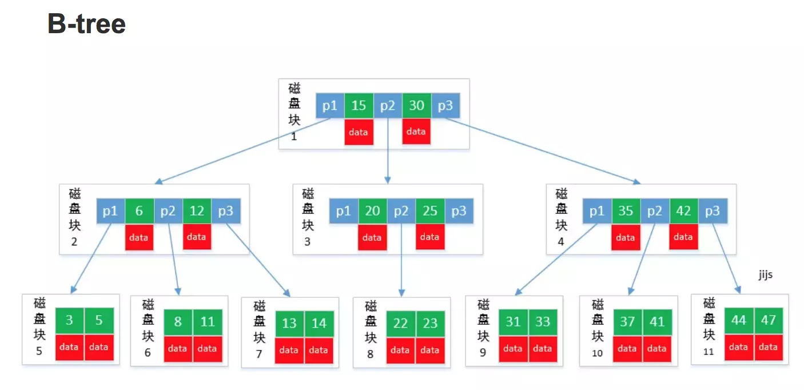
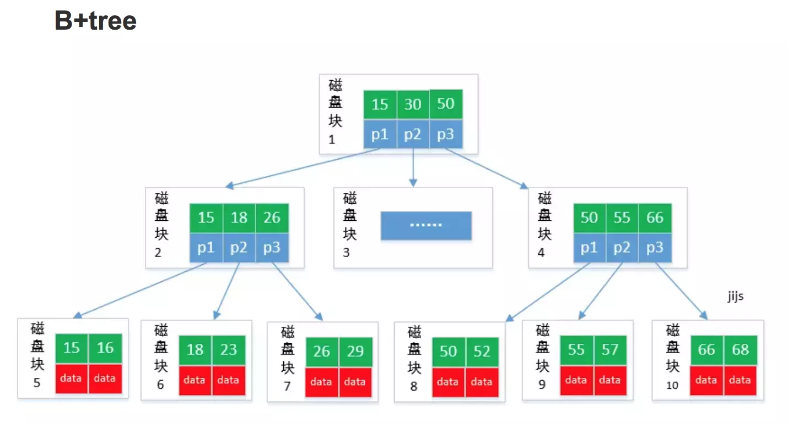
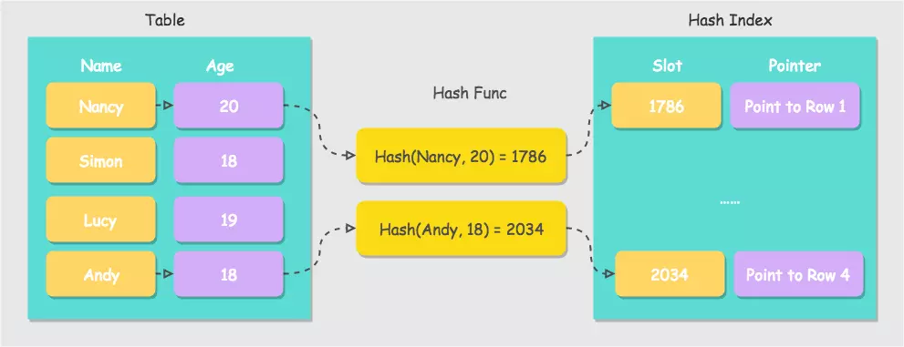
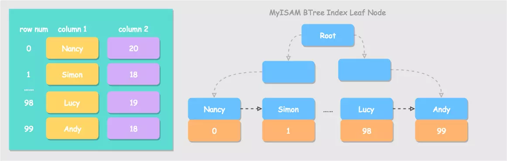
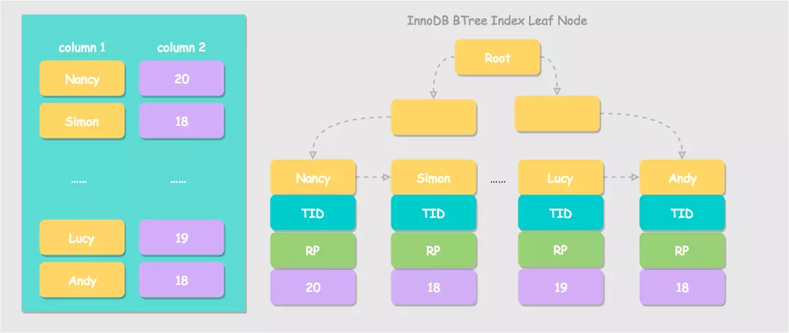
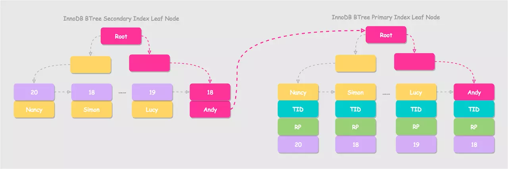

[TOC]
## 1. 简介
我们知道MySQL的数据是存放在磁盘上的，而读取磁盘的IO开销非常大，当需要定位到磁盘的具体位置时就需要几次IO操作，所以每次进行查找时就要想办法尽量控制对磁盘的IO操作次数，而B+树的结构正好满足。

B/B+树是为了磁盘或其它存储设备而设计的一种平衡多路查找树(相对于二叉，B树每个内节点有多个分支)，

与红黑树相比，在相同的的节点的情况下，一颗B/B+树的高度远远小于红黑树的高度(在下面B/B+树的性能分析中会提到)。
B/B+树上操作的时间通常由存取磁盘的时间和CPU计算时间这两部分构成，而CPU的速度非常快，所以B树的操作效率取决于访问磁盘的次数，关键字总数相同的情况下B树的高度越小，磁盘I/O所花的时间越少。

## 2. 那么为什么采用B+树而不是B树呢？

我们先来看两者结构上的区别：

* **B+树的磁盘读写代价更低，**因为B+树的所有**非叶子节点只会存放索引信息**，而**真正的数据信息都只存放在叶子节点中**，这样一来，每个非叶子节点存放的索引信息就更多，一次磁盘IO就可以读取更多的索引信息到内存中，可以减少磁盘IO的次数。

* **B+树的查询效率更加稳定**，由于非叶子节点只存索引信息，而没有真正的数据信息，所以任何关键字的查找必须走一条从根结点到叶子结点的路。所有关键字查询的路径长度相同，导致每一个数据的查询效率相当。

* **B+树更加适合在区间查询的情况**，由于B+树的数据都存储在叶子结点中，非叶子结点均为索引，只需要扫一遍叶子结点即可得到所有数据信息，但是B树因为其非叶子结点同样存储着数据，我们要找到具体的数据，需要进行一次中序遍历按序来扫，所以B+树更加适合在区间查询的情况，所以通常B+树用于数据库索引。

## 3. 哈希索引

基于哈希表实现，只有精确匹配所有列的查询才有效。实现方法为，对于每一行数据，存储引擎都会对所有的索引列计算出一个哈希码，哈希码是一个较小的值，哈希索引将所有行算出的哈希码存储在索引中，并为每一个哈希码维护指向具体某一行的指针。

MySQL 中只有 Memory 引擎显式支持哈希索引。InnoDB 支持的哈希索引是自适应的，用户无法进行配置，InnoDB 引擎会根据表的使用情况自动为表生成哈希索引。使用哈希索引的好处在于时间复杂度为 O(1)，因此哈希索引的查询效率要远高于 BTree 索引。但是其限制在于：
1. 只有精确匹配索引所有列的查询才有效,因为哈希索引是利用索引的所有列的字段值来计算哈希值的。
2. 只支持等值比较查询，不能用于范围查询。
3. 哈希索引的只包含索引字段的哈希值和指向数据的指针，所以不能使用索引中的值来避免读取行。
4. 哈希索引的数据并不是顺序存储的，无法用于排序。

## 4. 空间数据索引
MyISAM 存储引擎支持空间索引，可以用作地理数据存储。平日使用场景不多此处不再详述。

## 5. 全文索引
全文索引是一种特殊的索引类型，它查找的是文本中的关键词，而不是直接比较索引中的值。它更类似于搜索引擎做的事情，而不是简单的 WHERE 条件匹配。实现方法是通过建立倒排索引，快速匹配文档，这种实现方式也在 Apache Lucene 这种全文检索库中出现。

## 6. MyISAM 中的索引详解

MyISAM 存储引擎的索引文件和数据文件是分开的，MyISAM 引擎按照数据插入顺序，将数据文件存储在磁盘上，例如下图中 99 条记录从上到下依次存储。MyISAM 引擎使用 B+ 树作为索引结构，叶节点存放的是数据记录的行指针，图中为了方便阅读以行号代替。

在 MyISAM 引擎中，对主键列建立的主索引和对其他列建立的辅助索引在结构上没有区别，主键索引就是一个名为 Primary 的唯一非空索引。

总结一下，MyISAM 引擎中索引查询的步骤为，先按照 B+ 树查询到叶子节点，如果指定的键值存在，则取出其对应的行指针的值，然后通过行指针，读取相应数据行的记录。

## 7. InnoDB 中的索引详解

### 聚簇索引
同 MyISAM 引擎不同，InnoDB 的数据文件本身就是索引文件，表数据文件本身就是按 B+ 树组织的一个索引结构，其叶子节点的键值就是表的主键，这种数据存储方式也被称为聚簇索引。由此可见，聚簇索引并不是一种单独的索引类型，而是一种数据存储方式。

聚簇索引的叶子节点都包含主键值、事务 ID、用于事务 MVCC 的回滚指针以及所有的剩余列。

### 辅助索引
辅助索引也叫非聚簇索引，二级索引等。同 MyISAM 引擎的辅助索引实现不同，InnoDB 的辅助索引，其叶子节点存储的不是行指针而是主键值，得到主键值再要查询具体行数据的话，要去聚簇索引中再查找一次，也叫回表。这样的策略优势是减少了当出现行移动或者数据页分裂时二级索引的维护工作。

