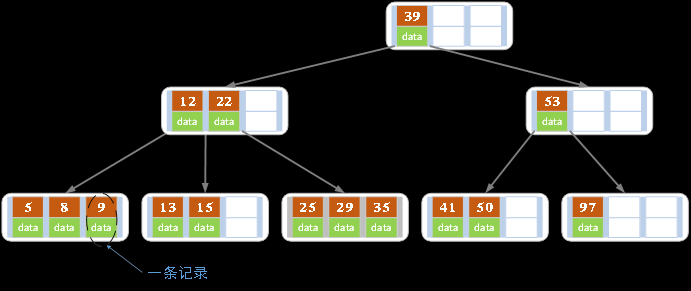

# 1. 为什么要有B树？

学习任何一个东西我们都要知道为什么要有它，B树也一样，既然存储数据，我们为什么不用红黑树呢？ 

这个要从几个方面来说了：
1. 计算机有一个**局部性原理**，就是说，当一个数据被用到时，其附近的数据也通常会马上被使用。

2. 所以当你**用红黑树的时候，你一次只能得到一个键值的信息，而用B树，可以得到最多M-1个键值的信息**。这样来说B树当然更好了。

3. 另外一方面，同样的数据，**红黑树的阶数更大，B树更短**，这样查找的时候当然B树更具有优势了，效率也就越高。

# 2. B树

对于B树，我们首先要知道它的应用，B树大量应用在数据库和文件系统当中。 

B树是对二叉查找树的改进。**它的设计思想是，将相关数据尽量集中在一起，以便一次读取多个数据，减少硬盘操作次数。**

B树为系统最优化大块数据的读和写操作。B树算法减少定位记录时所经历的中间过程，从而加快存取速度。普遍运用在数据库和文件系统。  

假定一个节点可以容纳100个值，那么3层的B树可以容纳100万个数据，如果换成二叉查找树，则需要20层！

假定操作系统一次读取一个节点，并且根节点保留在内存中，那么B树在100万个数据中查找目标值，只需要读

取两次硬盘。B 树可以看作是对2-3查找树的一种扩展，即他允许每个节点有M-1个子节点。

## 2.1 B树的定义

B树也称B-树,它是一颗多路平衡查找树。我们描述一颗B树时需要指定它的阶数，**阶数表示了一个结点最多有多少个孩子结点**，一般用字母m表示阶数。当m取2时，就是我们常见的二叉搜索树。

一颗m阶的B树定义如下：
1. 每个结点最多有m-1个关键字。

2. 根结点最少可以只有1个关键字。

3. 非根结点至少有Math.ceil(m/2)-1个关键字。`Math.ceil()表示向上取整`

4. 每个结点中的关键字都按照从小到大的顺序排列，每个关键字的左子树中的所有关键字都小于它，而右子树中的所有关键字都大于它。

5. 所有叶子结点都位于同一层，或者说根结点到每个叶子结点的长度都相同。

上图是一颗阶数为4的B树。在实际应用中的B树的阶数m都非常大（通常大于100），所以即使存储大量的数

据，B树的高度仍然比较小。每个结点中存储了关键字（key）和关键字对应的数据（data），以及孩子结点的

指针。我们将一个key和其对应的data称为一个记录。但为了方便描述，除非特别说明，后续文中就用key来

代替（key, value）键值对这个整体。在数据库中我们将B树（和B+树）作为索引结构，可以加快查询速速，

此时B树中的key就表示键，而data表示了这个键对应的条目在硬盘上的逻辑地址。

## 2.2 B树的插入操作

插入操作是指插入一条记录，即（key, value）的键值对。如果B树中已存在需要插入的键值对，则用需要插

入的value替换旧的value。若B树不存在这个key,则一定是在叶子结点中进行插入操作。

1. 根据要插入的key的值，找到叶子结点并插入。

2. 判断当前结点key的个数是否小于等于m-1，若满足则结束，否则进行第3步。

3.  以结点中间的key为中心分裂成左右两部分，然后将这个中间的key插入到父结点中，这个key的左子树指向分裂后的左半部分，这个key的右子支指向分裂后的右半部分，然后将当前结点指向父结点，继续进行第3步。

下面以5阶B树为例，介绍B树的插入操作，在5阶B树中，结点最多有4个key,最少有2个key

1. 在空树中插入39

此时根结点就一个key，此时根结点也是叶子结点

2. 继续插入22，97和41

根结点此时有4个key
3. 继续插入53

插入后超过了最大允许的关键字个数4，所以以key值为41为中心进行分裂，结果如下图所示，分裂后当前结点指针指向父结点，满足B树条件，插入操作结束。当阶数m为偶数时，需要分裂时就不存在排序恰好在中间的key，那么我们选择中间位置的前一个key或中间位置的后一个key为中心进行分裂即可。

4. 依次插入13，21，40，同样会造成分裂，结果如下图所示。

5. 依次插入30，27, 33 ；36，35，34 ；24，29，结果如下图所示。

6. 插入key值为26的记录，插入后的结果如下图所示。

当前结点需要以27为中心分裂，并向父结点进位27，然后当前结点指向父结点，结果如下图所示。

进位后导致当前结点（即根结点）也需要分裂，分裂的结果如下图所示。
分裂后当前结点指向新的根，此时无需调整。

7. 最后再依次插入key为17,28,29,31,32的记录，结果如下图所示。

在实现B树的代码中，为了使代码编写更加容易，我们可以将结点中存储记录的数组长度定义为m而非m-1，

这样方便底层的结点由于分裂向上层插入一个记录时，上层有多余的位置存储这个记录。同时，每个结点还可

以存储它的父结点的引用，这样就不必编写递归程序。一般来说，对于确定的m和确定类型的记录，结点大小

是固定的，无论它实际存储了多少个记录。但是分配固定结点大小的方法会存在浪费的情况，比如key为28,29

所在的结点，还有2个key的位置没有使用，但是已经不可能继续在插入任何值了，因为这个结点的前序key

是27,后继key是30,所有整数值都用完了。所以如果记录先按key的大小排好序，再插入到B树中，结点的使用

率就会很低，最差情况下使用率仅为50%。

## 2.3 B树的删除操作
删除操作是指，根据key删除记录，如果B树中的记录中不存对应key的记录，则删除失败。

1. 如果当前需要删除的key位于非叶子结点上，则用后继key（这里的后继key均指后继记录的意思）覆盖要删除的key，然后在后继key所在的子支中删除该后继key。此时后继key一定位于叶子结点上，这个过程和二叉搜索树删除结点的方式类似。删除这个记录后执行第2步
 
2. 该结点key个数大于等于Math.ceil(m/2)-1，结束删除操作，否则执行第3步。

3. 如果兄弟结点key个数大于Math.ceil(m/2)-1，则父结点中的key下移到该结点，兄弟结点中的一个key上移，删除操作结束。

4. 否则，将父结点中的key下移与当前结点及它的兄弟结点中的key合并，形成一个新的结点。原父结点中的key的两个孩子指针就变成了一个孩子指针，指向这个新结点。然后当前结点的指针指向父结点，重复上第2步。

5. 有些结点它可能即有左兄弟，又有右兄弟，那么我们任意选择一个兄弟结点进行操作即可。

下面以5阶B树为例，介绍B树的删除操作，5阶B树中，结点最多有4个key,最少有2个key
1. 原始状态

2. 在上面的B树中删除21，删除后结点中的关键字个数仍然大于等2，所以删除结束。

3. 在上述情况下接着删除27。从上图可知27位于非叶子结点中，所以用27的后继替换它。从图中可以看出，27的后继为28，我们用28替换27，然后在28（原27）的右孩子结点中删除28。删除后的结果如下图所示。
删除后发现，当前叶子结点的记录的个数小于2，而它的兄弟结点中有3个记录（当前结点还有一个右兄弟，选择右兄弟就会出现合并结点的情况，不论选哪一个都行，只是最后B树的形态会不一样而已），我们可以从兄弟结点中借取一个key。所以父结点中的28下移，兄弟结点中的26上移,删除结束。结果如下图所示。

4. 在上述情况下接着32，结果如下图。

当删除后，当前结点中只key，而兄弟结点中也仅有2个key。所以只能让父结点中的30下移和这个两个孩子结点中的key合并，成为一个新的结点，当前结点的指针指向父结点。结果如下图所示。

当前结点key的个数满足条件，故删除结束。

5. 上述情况下，我们接着删除key为40的记录，删除后结果如下图所示。
同理，当前结点的记录数小于2，兄弟结点中没有多余key，所以父结点中的key下移，和兄弟（这里我们选择左兄弟，选择右兄弟也可以）结点合并，合并后的指向当前结点的指针就指向了父结点。

同理，对于当前结点而言只能继续合并了，最后结果如下所示。

合并后结点当前结点满足条件，删除结束。

# 3.B+树
## 3.1 B+树的定义

各种资料上B+树的定义各有不同，一种定义方式是关键字个数和孩子结点个数相同。这里我们采取维基百科上

所定义的方式，即关键字个数比孩子结点个数小1，这种方式是和B树基本等价的。上图就是一颗阶数为4的

B+树。除此之外B+树还有以下的要求。
1. B+树包含2种类型的结点：内部结点（也称索引结点）和叶子结点。根结点本身即可以是内部结点，也可以是叶子结点。根结点的关键字个数最少可以只有1个。

2. B+树与B树最大的不同是内部结点不保存数据，只用于索引，所有数据（或者说记录）都保存在叶子结点中。

3. m阶B+树表示了内部结点最多有m-1个关键字（或者说内部结点最多有m个子树），阶数m同时限制了叶子结点最多存储m-1个记录。

4. 内部结点中的key都按照从小到大的顺序排列，对于内部结点中的一个key，左树中的所有key都小于它，右子树中的key都大于等于它。叶子结点中的记录也按照key的大小排列。

5. 每个叶子结点都存有相邻叶子结点的指针，叶子结点本身依关键字的大小自小而大顺序链接。
## 3.2 B+树的插入操作
1. 若为空树，创建一个叶子结点，然后将记录插入其中，此时这个叶子结点也是根结点，插入操作结束。

2. 针对叶子类型结点：根据key值找到叶子结点，向这个叶子结点插入记录。插入后，若当前结点key的个数小于等于m-1，则插入结束。否则将这个叶子结点分裂成左右两个叶子结点，左叶子结点包含前m/2个记录，右结点包含剩下的记录，将第m/2+1个记录的key进位到父结点中（父结点一定是索引类型结点），进位到父结点的key左孩子指针向左结点,右孩子指针向右结点。将当前结点的指针指向父结点，然后执行第3步。
3. 针对索引类型结点：若当前结点key的个数小于等于m-1，则插入结束。否则，将这个索引类型结点分裂成两个索引结点，左索引结点包含前(m-1)/2个key，右结点包含m-(m-1)/2个key，将第m/2个key进位到父结点中，进位到父结点的key左孩子指向左结点, 进位到父结点的key右孩子指向右结点。将当前结点的指针指向父结点，然后重复第3步。

下面是一颗5阶B树的插入过程，5阶B数的结点最少2个key，最多4个key。

1. 空树中插入5

2. 依次插入8，10，15

3. 插入16

插入16后超过了关键字的个数限制，所以要进行分裂。在叶子结点分裂时，分裂出来的左结点2个记录，右边3个记录，中间key成为索引结点中的key，分裂后当前结点指向了父结点（根结点）。结果如下图所示。

当然我们还有另一种分裂方式，给左结点3个记录，右结点2个记录，此时索引结点中的key就变为15。

4. 插入17

5. 插入18，插入后如下图所示

当前结点的关键字个数大于5，进行分裂。分裂成两个结点，左结点2个记录，右结点3个记录，关键字16进位到父结点（索引类型）中，将当前结点的指针指向父结点。

当前结点的关键字个数满足条件，插入结束。

6. 插入若干数据后

7. 在上图中插入7，结果如下图所示

当前结点的关键字个数超过4，需要分裂。左结点2个记录，右结点3个记录。分裂后关键字7进入到父结点中，将当前结点的指针指向父结点，结果如下图所示。

当前结点的关键字个数超过4，需要继续分裂。左结点2个关键字，右结点2个关键字，关键字16进入到父结点中，将当前结点指向父结点，结果如下图所示。

当前结点的关键字个数满足条件，插入结束。
## 3.3 B+树的删除操作
如果叶子结点中没有相应的key，则删除失败。否则执行下面的步骤

1. 删除叶子结点中对应的key。删除后若结点的key的个数大于等于Math.ceil(m-1)/2 – 1，删除操作结束,否则执行第2步。

2. 若兄弟结点key有富余（大于Math.ceil(m-1)/2 – 1），向兄弟结点借一个记录，同时用借到的key替换父结（指当前结点和兄弟结点共同的父结点）点中的key，删除结束。否则执行第3步。

3. 若兄弟结点中没有富余的key,则当前结点和兄弟结点合并成一个新的叶子结点，并删除父结点中的key（父结点中的这个key两边的孩子指针就变成了一个指针，正好指向这个新的叶子结点），将当前结点指向父结点（必为索引结点），执行第4步（第4步以后的操作和B树就完全一样了，主要是为了更新索引结点）。

4. 若索引结点的key的个数大于等于Math.ceil(m-1)/2 – 1，则删除操作结束。否则执行第5步

5. 若兄弟结点有富余，父结点key下移，兄弟结点key上移，删除结束。否则执行第6步

6. 当前结点和兄弟结点及父结点下移key合并成一个新的结点。将当前结点指向父结点，重复第4步。注意，通过B+树的删除操作后，索引结点中存在的key，不一定在叶子结点中存在对应的记录。

下面是一颗5阶B树的删除过程，5阶B数的结点最少2个key，最多4个key。
1. 初始状态

2. 删除22,删除后结果如下图

删除后叶子结点中key的个数大于等于2，删除结束

3. 删除15，删除后的结果如下图所示

删除后当前结点只有一个key,不满足条件，而兄弟结点有三个key，可以从兄弟结点借一个关键字为9的记录,同时更新将父结点中的关键字由10也变为9，删除结束。

4. 删除7，删除后的结果如下图所示

当前结点关键字个数小于2，（左）兄弟结点中的也没有富余的关键字（当前结点还有个右兄弟，不过选择任意一个进行分析就可以了，这里我们选择了左边的），所以当前结点和兄弟结点合并，并删除父结点中的key，当前结点指向父结点。

此时当前结点的关键字个数小于2，兄弟结点的关键字也没有富余，所以父结点中的关键字下移，和两个孩子结点合并，结果如下图所示。

