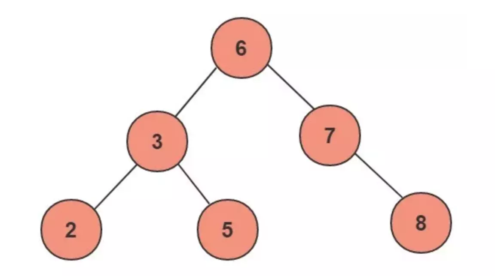
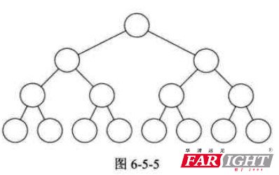
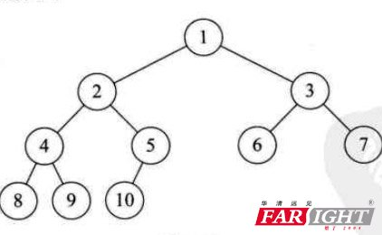

### 1.1 性质

* 任意节点左子树不为空,则左子树的值均小于根节点的值；
* 任意节点右子树不为空,则右子树的值均大于于根节点的值；
* 任意节点的左右子树也分别是二叉查找树；
* 没有键值相等的节点； 

上图为一个普通的二叉查找树，按照中序遍历的方式可以从小到大的顺序排序输出：2、3、5、6、7、8。

对上述二叉树进行查找，如查键值为5的记录，先找到根，其键值是6，6大于5，因此查找6的左子树，找到3；而5大于3，再找其右子树；一共找了3次。如果按2、3、5、6、7、8的顺序来找同样需求3次。用同样的方法在查找键值为8的这个记录，这次用了3次查找，而顺序查找需要6次。计算平均查找次数得：顺序查找的平均查找次数为（1+2+3+4+5+6）/ 6 = 3.3次，二叉查找树的平均查找次数为（3+3+3+2+2+1）/6=2.3次。二叉查找树的平均查找速度比顺序查找来得更快。

### 1.2 局限性
一个二叉查找树是由n个节点随机构成，所以，对于某些情况，二叉查找树会退化成一个有n个节点的线性链。如果我们的根节点选择是最小或者最大的数，那么二叉查找树就完全退化成了线性结构。显然这个二叉树的查询效率就很低，因此若想最大性能的构造一个二叉查找树，需要这个二叉树是平衡的（这里的平衡从一个显著的特点可以看出这一棵树的高度比上一个输的高度要大，在相同节点的情况下也就是不平衡），从而引出了一个新的定义-平衡二叉树AVL。

### 1.3 特殊二叉树
#### 满二叉树

在一颗二叉树中，如果所有的分支节点都存在左子树和右子树，并且所有的叶子节点都在同一层上，这样的二叉树，我们称之为满二叉树。

#### 完全二叉树

对一颗具有n个结点的二叉树按层进行编号，
如果编号为i(1 <= i <= n)的结点与同样深度的满二叉树节点编号为i的结点在二叉树中的位置完全相同，
则这颗树，我们称之为完全二叉树。

