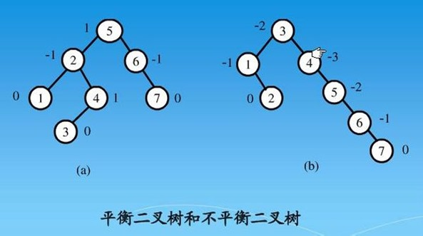
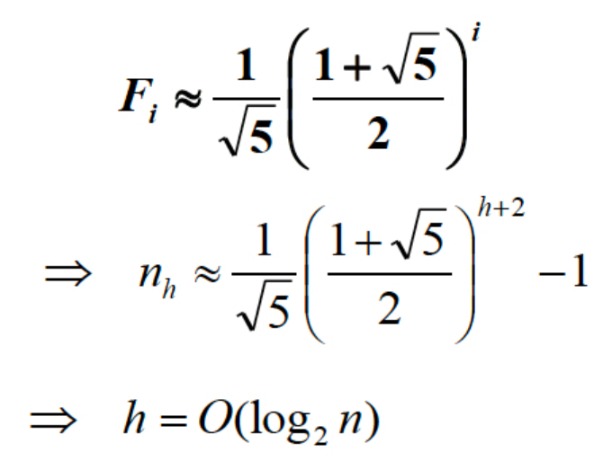
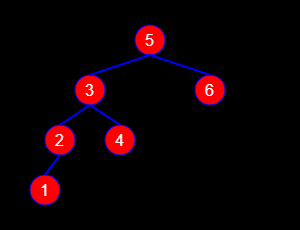
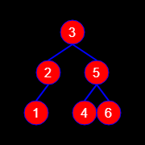
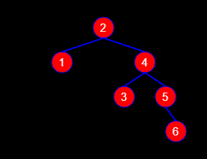
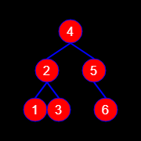
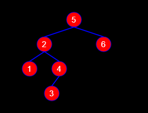
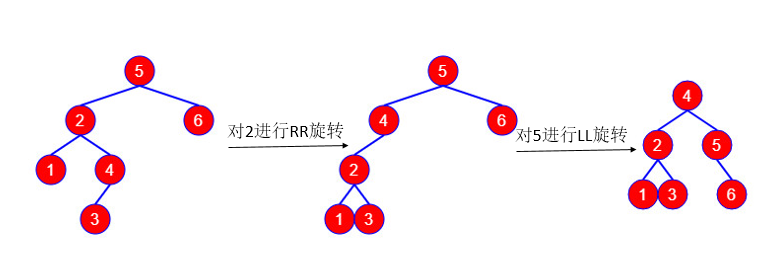
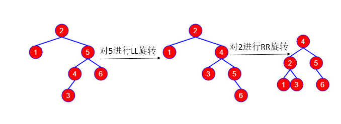
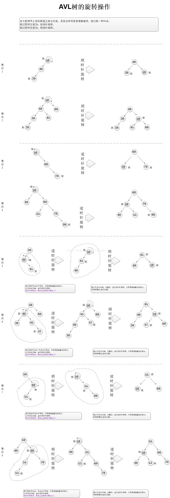

# 1 特性
AVL树是带有平衡条件的二叉查找树，一般是用平衡因子差值判断是否平衡并通过旋转来实现平衡，左右子树高度差不超过1，和红黑树相比，它是严格的平衡二叉树，平衡条件必须满足（所有节点的左右子树高度差不超过1）。不管我们是执行插入还是删除操作，只要不满足上面的条件，就要通过旋转来保持平衡，而旋转是非常耗时的，由此我们可以知道AVL树适合用于插入删除次数比较少，但查找多的情况。

# 2 局限性

由于维护这种高度平衡所付出的代价比从中获得的效率收益还大，故而实际的应用不多，更多的地方是用追求局部而不是非常严格整体平衡的红黑树。当然，如果应用场景中对插入删除不频繁，只是对查找要求较高，那么AVL还是较优于红黑树。

# 3 详细解释

## 3.1 定义
平衡二叉树建立在二叉排序树的基础上，目的是使二叉排序树的平均查找长度更小，即让各结点的深度尽可能小，因此，树中每个结点的两棵子树的深度不要偏差太大。

平衡二叉树的**递归定义**：平衡二叉树是一棵二叉树，其可以为空，或满足如下2个性质：①左右子树深度之差的绝对值不大于1。②左右子树都是平衡二叉树。

**平衡因子**的概念：结点的平衡因子 = 结点的左子树深度 — 结点的右子树深度。**若平衡因子的取值为-1、0或1时，该节点是平衡的，否则是不平衡的。**



## 3.2 AVL树的高度

### 引导问题：求一棵二叉树的节点数目：

假设一颗二叉树T，其左右子树分别为TL,TR。又假设T的节点数目为F(T),TL，TR的节点数目分别为F(TL),F(TR)。则显然：

F(T) = F(TL) + F(TR) + 1。（1为顶点）

### 本文的问题：求高度为n的平衡二叉树最小需要多少节点：

假设T为高度为h的平衡二叉树，其需要最少的节点数目为F(h)。又假设TL，TR为T的左右子树，因此TL，TR也为平衡二叉树。

假设F1,F2为TL，TR的最少节点数，则，F(h) = F1+F2 +1。那么F1,F2 到底等于多少呢？

由于TL，TR与T一样是平衡二叉树，又由于我们知道T的最少节点数是F(h),其中h为T的高度，

因此如果我们知道TL，TR的高度就可以知道F1,F2的值了。

由平衡二叉树的定义可以知道，TL和TR的高度要么相同，要么相差1，

而当TL与TR高度相同(即:都等于n-1)时，我们算出来的F(n)并不能保证最小，因此只有当TL与TR高度相差一(即：一个高度为n-1，一个高度为n-2)时，计算出来的F(n)才能最小。

此时我们假设TL比TR高度要高1(即：TL高度为n-1，TR高度为n-2)，则有：F1 = F(n-1),F2 = F(n-2)。因此得到结论：
```log
F(n) = F(n-1) + F(n -2 ) + 1
     =  F(n+2) - 1
```
F(n)为斐波那契数列



## 3.3 AVL树的时间复杂度


|操作	| 二叉查找树| 	平衡二叉树	| 红黑树|
| --- | --- | --- |--- |
|查找	|  O(n)	| O(logn)| 	O(logn)| 
|插入	| O(n)	| O(logn)| 	O(logn)| 
|删除	| O(n)	| O(logn)| 	O(logn)| 
log以2为底。
> Olog(n)怎么算出来的？

1. 在一个树中查找一个数字，
2. 第一次在根节点判断，第二次在第二层节点判断
3. 以此类推，树的高度是多少就会判断多少次
4. 树的高度和节点的关系就是以2为底，树的节点总数n的对数


## 3.4 AVL树旋转
在进行插入和删除之前需要先了解AVL树的旋转操作。旋转操作主要包括LL（左左）旋转、LR（左右）旋转、RR（右右）旋转、RL（右左）旋转，LL旋转与RR旋转对称，LR旋转与RL旋转对称。旋转操作是在插入结点或删除结点导致原AVL树不平衡时进行的。我的理解是当二叉树失衡的原因出现在“最低失衡根结点左子树的左子树”（所谓“最低失衡根结点”，则是从新增结点开始向根部回溯，所遇到的第一个失衡的根节点）时，则使用LL旋转来调整；当失衡出现在“最低失衡根节点左子树的右子树”，则使用LR旋转调整；RR旋转，RL旋转同理。
**1. LL旋转**



如上图所示，找到“最低失衡根结点”，上图是结点5，二叉树失衡的原因是因为结点1的存在，而结点1位于结点5“左子树的左子树”，所以要使用LL旋转来调节，只需一次旋转即可达到平衡。具体的方法是：LL旋转的对象是“最低失衡根结点”，也就是结点5，找到5的左孩子3，将3的右孩子4变成5的左孩子，最后将5变成3的右孩子，调整后的AVL树如下所示：



**2. RR旋转**

RR旋转与LL旋转对称。



如上图所示，“最低失衡根结点”是结点2，二叉树的失衡是结点6导致的，而结点6位于结点2“右子树的右子树”，所以要使用RR旋转来调节，只需一次旋转即可达到平衡。方法与LL旋转类似：RR旋转的对象是“最低失衡根结点”，这里是结点2，找到2的右孩子4，将4的左孩子3变成2的右孩子，最后将2变成4的右孩子，旋转后的结果如下图所示：



**3. LR旋转**
LR旋转和RL旋转这个比较难理解，笔者也是查了好多资料才搞懂，下面一起看下。LL旋转和RR旋转只需一次旋转即可达到平衡，而LR旋转和RL旋转需两次旋转才能达到平衡。



如上图所示，“最低失衡根结点”为结点5，二叉树失衡是因为结点3的存在，结点3位于结点5“左子树的右子树”，所以使用LR旋转来调节。方法：（1）先对最低失衡根结点的左孩子（结点2）进行RR旋转；（2）再对最低失衡根结点（结点5）进行LL旋转。下图演示了调整过程。



**4. RL旋转**

RL旋转与LR旋转对称，先LL旋转，在RR旋转。


分析过程与LR相似。旋转步骤：（1）先对最低失衡结点右孩子（结点5）LL旋转；（2）在对最低失衡结点（结点2）RR旋转。旋转过程如下：



由于AVL树需要做到平衡，所以每次插入叶子节点，如果发现不平衡，都需要进行旋转以保持平衡。上面如果还未理解，这里转载了一个图片，描述了AVL树旋转平衡的操作——

