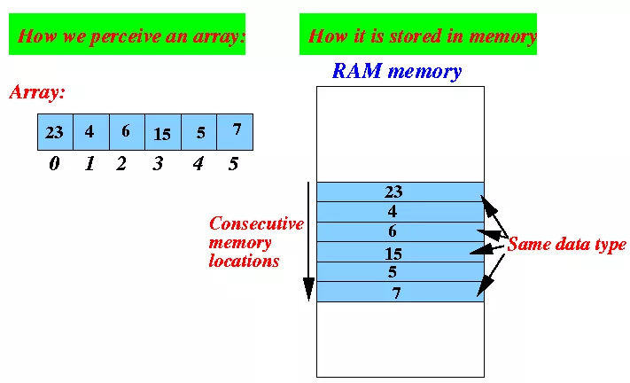
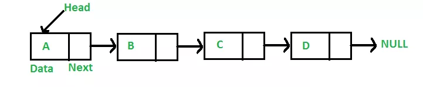
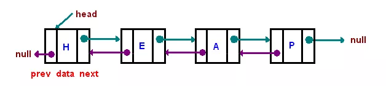
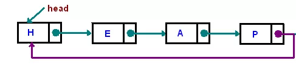
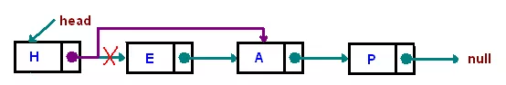
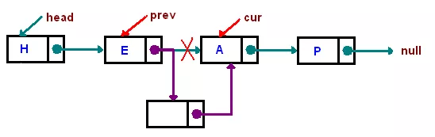

数据的逻辑结构主要分为两种：

* 线性的：就是连成一条线的结构，本文要讲的数组和链表就属于这一类，另外还有 队列、栈 等

* 非线性的：顾名思义，数据之间的关系是非线性的，比如 堆、树、图 等

# 一、「 数组 」是什么？
数组是一个有限的、类型相同的数据的集合，**在内存中是一段连续的内存区域**。

如下图：



数组的下标是从0开始的，上图数组中有6个元素，对应着下标依次是0、1、2、3、4、5，

同时，数组里面存的数据的类型必须是一致的，比如上图中存的都是数字类型。

数组中的全部元素是“连续”的存储在一块内存空间中的，如上图右边部分，元素与元素之间是不会有别的存储隔离的。

另外，也是因为数组需要连续的内存空间，所以数组在定义的时候就需要提前指定固定大小，不能改变。

## 数组的访问

数组在访问操作方面有着独特的性能优势，

因为数组是支持随机访问的，也就是说我们可以通过下标随机访问数组中任何一个元素，

其原理是因为数组元素的存储是连续的，所以我们可以通过数组内存空间的首地址加上元素的偏移量计算出某一个元素的内存地址，如下：
```java
array[n]的地址 =  array数组内存空间的首地址 + 每个元素大小*n
```

通过上述公式可知：

数组中通过下标去访问数据时并不需要遍历整个数组，因此**数组的访问时间复杂度是 O(1)**，

当然这里需要注意，如果不是通过下标去访问，而是通过内容去查找数组中的元素，则时间复杂度不是O(1)，

极端的情况下需要遍历整个数组的元素，时间复杂度可能是O(n)，

当然通过不同的查找算法所需的时间复杂度是不一样的。

## 数组的插入与删除

同样是因为数组元素的连续性要求，所以导致数组在插入和删除元素的时候效率比较低。

如果要在数组中间插入一个新元素，就必须要将要相邻的后面的元素全部往后移动一个位置，留出空位给这个新元素。

还是拿上面那图举例，如果需要在下标为2的地方插入一个新元素11，那就需要将原有的2、3、4、5几个下标的元素依次往后移动一位，新元素再插入下标为2的位置，最后形成新的数组是：
```java
23、4、11、6、15、5、7
```

如果新元素是插入在数组的最开头位置，那整个原始数组都需要向后移动一位，此时的时间复杂度为最坏情况即O(n)，

如果新元素要插入的位置是最末尾，则无需其它元素移动，则此时时间复杂度为最好情况即O(1)，

所以平均而言数组插入的时间复杂度是O(n)

数组的删除与数组的插入是类似的。

# 二、「 链表 」是什么？


**链表**是一种物理存储单元上非连续、非顺序的存储结构，

数据元素的逻辑顺序是通过链表中的指针链接次序实现的，**一般用于插入与删除较为频繁的场景**。




上图是“单链表”示例，链表并不需要数组那样的连续空间，它只需要一个个零散的内存空间即可，因此对内存空间的要求也比数组低。

链表的每一个节点通过“指针”链接起来，每一个节点有2部分组成，
* 一部分是数据（上图中的Data），
* 另一部分是后继指针（用来存储后一个节点的地址），

在这条链中，最开始的节点称为Head，最末尾节点的指针指向NULL。

「 链表 」也分为好几种，上图是最简单的一种，它的每一个节点只有一个指针（后继指针）指向后面一个节点，这个链表称为：**单向链表**，除此之外还有 双向链表、循环链表 等。


## 双向链表：




双向链表与单向链表的区别是前者是2个方向都有指针，后者只有1个方向的指针。

双向链表的每一个节点都有2个指针，一个指向前节点，一个指向后节点。

双向链表在操作的时候比单向链表的效率要高很多，但是由于多一个指针空间，所以占用内存也会多一点。

## 循环链表：



其实循环链表就是一种特殊的单向链表，

只不过在单向链表的基础上，将尾节点的指针指向了Head节点，使之首尾相连。


## 链表的访问

链表的优势并不在与访问，因为链表无法通过首地址和下标去计算出某一个节点的地址，

所以链表中如果要查找某个节点，则需要一个节点一个节点的遍历，因此链表的访问时间复杂度为O(n)

## 链表的插入与删除

也正式因为链表内存空间是非连续的，所以它对元素的插入和删除时，并不需要像数组那样移动其它元素，**只需要修改指针的指向即可。**

例如：删除一个元素E：



例如：插入一个元素：




既然插入与删除元素只需要改动指针，无需移动数据，那么**链表的时间插入删除的时间复杂度为O(1)**

不过这里指的是找到节点之后纯粹的插入或删除动作所需的时间复杂度。如果当前还未定位到指定的节点，只是拿到链表的Head，这个时候要去删除此链表中某个固定内容的节点，则需要先查找到那个节点，这个查找的动作又是一个遍历动作了，这个遍历查找的时间复杂度却是O(n)，两者加起来总的时间复杂度其实是O(n)的。

其实就算是已经定位到了某个要删除的节点了，删除逻辑也不简单。以“删除上图的E节点”为例，假如当前链表指针已经定位到了E节点，删除的时候，需要将这个E节点的前面一个节点H的后继指针改为指向A节点，那么E节点就会自动脱落了，但是当前链表指针是定位在E节点上，如何去改变H节点的后续指针呢，

对于 **单向链表** 而言，这个时候需要从头遍历一遍整个链表，找到H节点去修改其后继指针的内容，所以时间复杂度是O(n)，

但如果当前是**双向链表**，则不需要遍历，直接通过前继指针即可找到H节点，时间复杂度是O(1)，这里就是**双向链表**相当于**单向链表**的优势所在。

# 三、「 数组和链表 」的算法实战？
> 算法题：反转一个单链表
> 输入: 1->2->3->4->5->NULL
> 输出: 5->4->3->2->1->NULL

```java
/**
 * Definition for singly-linked list.
 * public class ListNode {
 *     int val;
 *     ListNode next;
 *     ListNode(int x) { val = x; }
 * }
 */
class Solution {
    public ListNode reverseList(ListNode head) {
        //定义一个前置节点变量，默认是null，因为对于第一个节点而言没有前置节点
        ListNode pre = null;
        //定义一个当前节点变量，首先将头节点赋值给它
        ListNode curr = head;
        //遍历整个链表，直到当前指向的节点为空，也就是最后一个节点了
        while(curr != null){
            //在循环体里会去改变当前节点的指针方向，本来当前节点的指针是指向的下一个节点，现在需要改为指向前一个节点，但是如果直接就这么修改了，那链条就断了，再也找不到后面的节点了，所以首先需要将下一个节点先临时保存起来，赋值到temp中，以备后续使用
            ListNode temp = curr.next;
            //开始处理当前节点，将当前节点的指针指向前面一个节点
            curr.next = pre;
            //将当前节点赋值给变量pre，也就是让pre移动一步，pre指向了当前节点
            pre = curr;
            //将之前保存的临时节点（后面一个节点）赋值给当前节点变量
            curr = temp;
            //循环体执行链表状态变更情况：
            //NULL<-1  2->3->4->5->NULL
            //NULL<-1<-2  3->4->5->NULL
            //NULL<-1<-2<-3  4->5->NULL
            //NULL<-1<-2<-3<-4  5->NULL
            //NULL<-1<-2<-3<-4<-5
            //循环体遍历完之后，pre指向5的节点
        }
        //完成，时间复杂度为O(n)
        return pre;
    }
}
```