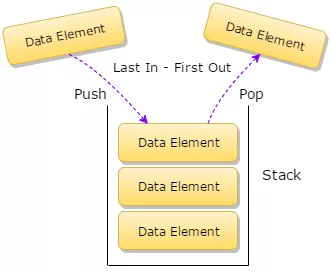

# 一、「 堆栈 」是什么？

**堆栈（stack）** 是一种先进后出的、操作受限的线性表，也可以直接称为 栈。



可以把栈想象成一个桶一样，往这个桶里面一层一层的放东西，先放进去的在里面，后放进去的东西依次在外面。但取东西的时候就是先取靠近外面的，再依次一层层取里面的。这就是 **后进先出（ Last In-First Out ）** 的原则。

因此「 栈 」虽然是线性的，有2个端：顶端和底端，但它只允许从一端进行插入和删除数据，这就是为啥前面说「 栈 」是操作受限的了。

栈只有两种操作：Push 和 Pop 。

我们用Push（压入）来表示往栈中插入数据，也叫入栈，

用Pop（弹出）来表示从栈中删除数据，也叫出栈。

我们可以既可以用 「 数组 」 来实现一个栈，也可以用 「 链表 」 来实现一个栈。

## 用数组实现的栈，叫做 顺序栈

顺序栈的实现非常简单，这里就不写代码了，写一下思路。先初始化一个数组，然后再用一个变量给这个数组里的元素进行计数，当有新元素需要入栈的时候，将这个新元素写入到数组的最后一个元素的后面，然后计数器加一。当需要做出栈操作时，将数组中最后一个元素返回，计数器减一。

当然在入栈前需要判断数组是否已经满了，如果数组大小等于计数器大小，则表明数组是满的。

出栈的时候也需要判断数组是不是空数组，如果计数器是0，则表明数组是空的。

从上面的实现流程可以看出，通过数组实现的栈，其入栈和出栈都是对单个元素进行操作，因此其入栈和出栈的时间复杂度都是O(1)，并且其入栈和出栈操作并没有额外开销更多空间，因此其空间复杂度也是O(1)的。

## 用链表实现的栈，叫做 链式栈
实现思路是先定义一个链表节点的类，基于这个类去定义一个头节点Head。仅仅是一个指针，不是具体的节点。
* 初始化时，Head节点为null，指向null。
* 当有新元素需要入栈的时候，Head=新元素，即将Head指针指向新元素。
* 当又有新元素要入栈的时候，采用头插法，将这个新元素的Next指针指向头结点Head，然后将Head指针指向新节点。
* 当需要做出栈操作时，直接将Head所指向的节点返回，同时让Head指向下一个节点。


当然，在入栈和出栈时都需要判断链表是否为空的情况。

链式栈的入栈和出栈都是在处理头部节点，所以操作很简单，其时间和空间复杂度均为O(1)。

# 二、「 堆栈 」的算法实践
> 算法题：给定一个只包括 '('，')'，'{'，'}'，'['，']' 的字符串，判断字符串是否有效。有效字符串需满足:
>    左括号必须用相同类型的右括号闭合。    
>   左括号必须以正确的顺序闭合。
>  举例：字符串 "()"有效、"()[]{}"有效、"(]"无效、"([)]"无效、"{[]}"有效。

解题思路：

* 使用1个堆栈即可解决，依次遍历这个字符串，

* 如果遇到是左括号就入栈到堆栈中，如果遇到的是右括号，则从堆栈中取出栈顶的第一个左括号，比对一下这个左括号和当前遇到的右括号是否匹配，

* 如果不匹配这认为这整个字符串无效。

* 如果能匹配，则OK，删除这个左括号和右括号，继续往后走，继续遍历字符串中剩下的字符，只要遇到左括号就入栈，只要遇到右括号就与将栈顶的左括号出栈与之比较。一直走到字符串结束，

* 再来检查堆栈中是否还有元素，如果还有元素，则这个字符串同样无效，如果堆栈为空，则字符串有效。

就以这个思路实现一个初版代码：

```java
class Solution {
    public boolean isValid(String s) {
        Stack<Character> satck = new Stack<Character>();
        for(int i=0; i<s.length();i++){
            char c = s.charAt(i);
            if(c=='(' || c=='{' || c=='['){
                satck.push(c);
            }else{
                if(satck.isEmpty()) return false;
                char temp = satck.pop();
                if( (temp=='('&&c==')') || (temp=='{'&&c=='}')  || (temp=='['&&c==']') ){
                    continue;
                }else{
                    return false;
                }
            }
        }
        return satck.isEmpty();
    }
}
```
这个代码的时间复杂度o(n),空间复杂度o(n)搞定。

但是想了想，好像代码不是很优雅，写了一个优化版，提前将左右括号放入到MAP中，这个方法的时间和空间复杂度跟上面的一样。

```java
class Solution {
    public boolean isValid(String s) {
      Stack<Character> stack = new Stack<Character>();
      HashMap<Character,Character> map = new HashMap<Character,Character>();
      map.put('(', ')');
      map.put('{','}' );
      map.put('[', ']');

      for(int i=0;i<s.length();i++){
        char c = s.charAt(i);
        if(map.containsKey(c)){
          stack.push(c);
        }else{
          if(stack.isEmpty()) return false;
          char temp = stack.pop();
          if(map.get(temp)!=c) return false;
        }
      } 
      return stack.isEmpty();
    }
}
```
继续思考有没有更简洁的方法，竟然在leetcode上找到了一个：
但是这个方法并没有用到堆栈哦，它的思路是不断的遍历这个字符串，将字符串中的(){}[]全部调换成空字符串，如果最后全部替换完成了，并且字符串为空了，就说明字符串是有效的，否者就是无效的字符串。
```java
class Solution {
    public boolean isValid(String s) {
      int length = s.length();
      do{
        length = s.length();
        s = s.replaceAll("\\(\\)","").replaceAll("\\{\\}","").replaceAll("\\[\\]","");
      }while(s.length()!=length);
      return s.length()==0;
    }
}
```