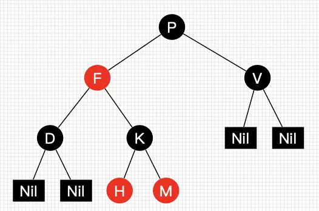
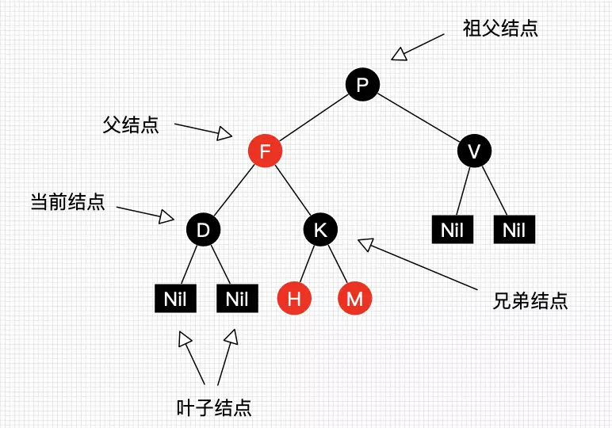
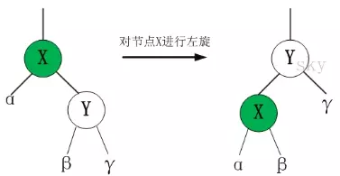
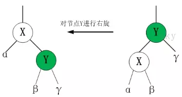
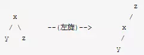
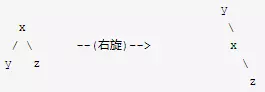
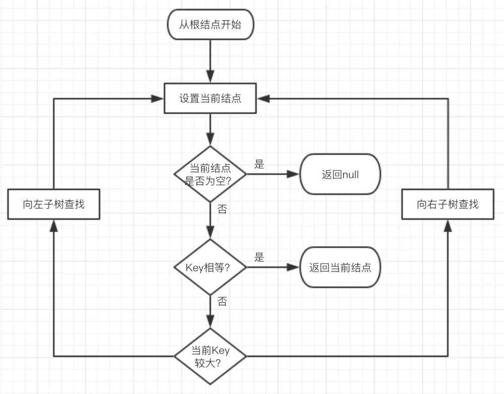

### 1. 红黑树简介

R-B Tree，全称是Red-Black Tree，又称为“红黑树”，它一种特殊的二叉查找树。红黑树的每个节点上都有存储位表示节点的颜色，可以是红(Red)或黑(Black)。
### 2. 红黑树的特性

红黑树是一种含有红黑结点并能自平衡的二叉查找树。它必须满足下面性质：

* 性质1：每个节点要么是黑色，要么是红色。
* 性质2：根节点是黑色。
* 性质3：每个叶子节点（NIL）是黑色。
* 性质4：每个红色结点的两个子结点一定都是黑色。
* 性质5：任意一结点到每个叶子结点的路径都包含数量相同的黑结点。
**从性质5又可以推出：**
* 性质5.1：如果一个结点存在黑子结点，那么该结点肯定有两个子结点图1就是一颗简单的红黑树。其中Nil为
叶子结点，并且它是黑色的。(值得提醒注意的是，在Java中，叶子结点是为null的结点。)

红黑树并不是一个完美平衡二叉查找树，从图可以看到，根结点P的左子树显然比右子树高，但左子树和右子树的黑结点的层数是相等的，也即任意一个结点到到每个叶子结点的路径都包含数量相同的黑结点(性质5)。所以我们叫红黑树这种平衡为黑色完美平衡。介绍到此，为了后面讲解不至于混淆，我们还需要来约定下红黑树一些结点的叫法，如下图所示。

我们把正在处理(遍历)的结点叫做当前结点，如图2中的D，它的父亲叫做父结点，它的父亲的另外一个子结点叫做兄弟结点，父亲的父亲叫做祖父结点。
### 3. 红黑树的操作

### 操作一：左旋和右旋

红黑树的基本操作是添加、删除。在对红黑树进行添加或删除之后，都会用到旋转方法。为什么呢？道理很简单，添加或删除红黑树中的节点之后，红黑树就发生了变化，可能不满足红黑树的5条性质，也就不再是一颗红黑树了，而是一颗普通的树。而通过旋转，可以使这颗树重新成为红黑树。简单点说，旋转的目的是让树保持红黑树的特性。旋转包括两种：左旋 和 右旋。

#### 1. 左旋

#### 2.右旋

#### 3.左旋和右旋的区别

仔细观察上面"左旋"和"右旋"的示意图。发现它们是对称的。无论是左旋还是右旋，被旋转的树，在旋转前是二叉查找树，并且旋转之后仍然是一颗二叉查找树。
**左旋：**对x进行左旋，意味着，将“x的右孩子”设为“x的父亲节点”；即，将 x变成了一个左节点(x成了为z的左孩子)！。 因此，左旋中的“左”，意味着“**被旋转的节点将变成一个左节点**”。如下图：

**右旋：**对x进行右旋，意味着，将“x的左孩子”设为“x的父亲节点”；即，将 x变成了一个右节点(x成了为y的右孩子)！ 因此，右旋中的“右”，意味着“**被旋转的节点将变成一个右节点**”。如下图：

### 操作二：查找

因为红黑树是一颗二叉平衡树，并且查找不会破坏树的平衡，所以查找跟二叉平衡树的查找无异：
1. 从根结点开始查找，把根结点设置为当前结点；
2. 若当前结点为空，返回null；
3. 若当前结点不为空，用当前结点的key跟查找key作比较；
4. 若当前结点key等于查找key，那么该key就是查找目标，返回当前结点；
5. 若当前结点key大于查找key，把当前结点的左子结点设置为当前结点，重复步骤2；
6. 若当前结点key小于查找key，把当前结点的右子结点设置为当前结点，重复步骤2；

正由于红黑树总保持黑色完美平衡，所以它的查找最坏时间复杂度为O(2lgN)，也即整颗树刚好红黑相隔的时候。能有这么好的查找效率得益于红黑树自平衡的特性。

### 操作三：插入与删除
 [过于复杂，参见](https://www.jianshu.com/p/e136ec79235c)
