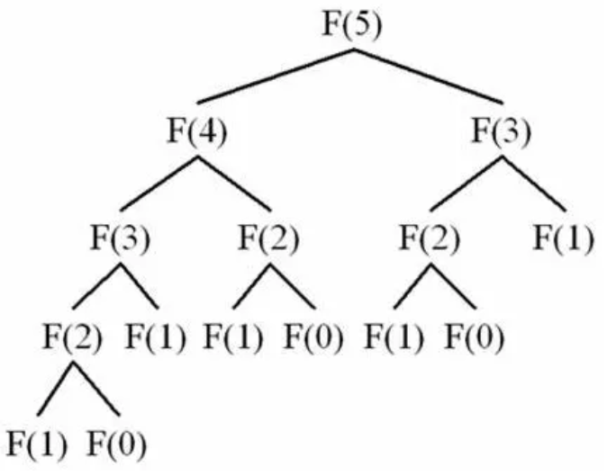
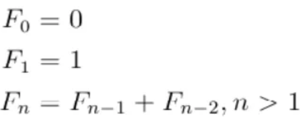
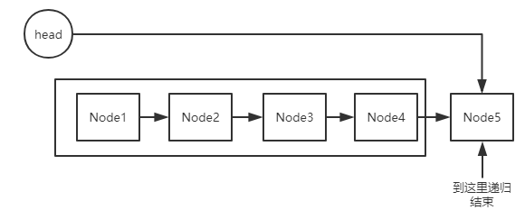
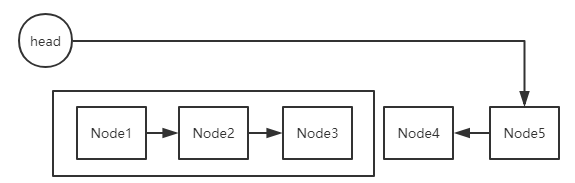
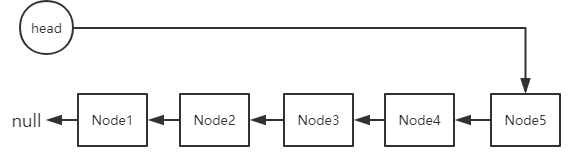

# 一、「 递归 」是什么？

**递归** 就是指函数直接或间接的调用自己，递归是基于栈来实现的。

**递归的经典例子就是斐波拉契数列（Fibonacci）**。

一般如果能用递归来实现的程序，那它也能用循环来实现。

用递归来实现的话，代码看起来更清晰一些，但**递归的性能并不占优势，时间复杂度甚至也会更大一些。**

**斐波拉契数列图例**



要实现递归，必须满足2个条件：

1. 可调用自己

    就是我们要解决的这个问题，可以通过函数调用自己的方式来解决，

    即可以通过将大问题分解为子问题，然后子问题再可以分解为子子问题，这样不停的分解。

    并且大问题与子问题/子子问题的解决思路是完全一样的，只不过数据不一样。

    因此这些问题都是通过某一个函数去解决的，最终我们看到的就是不停得函数调用自己，然后就把问题化解了。

    如果这个问题不能分解为子问题，或子问题的解决方法与大问题不一样，那就无法通过递归调用来解决。

2. 可停止调用自己

    停止调用的条件非常关键，就是大问题不停的一层层分解为小问题后，最终必须有一个条件是来终止这种分解动作的（也就是停止调用自己）。
    
    做递归运算一定要有这个终止条件，否则就会陷入无限循环。
    
## 以 斐波拉契数列（Fibonacci）为例理解递归
> 斐波拉契数列就是由数字 1，1，2，3，5，8，13…… 组成的这么一组序列，特点是每位数字都是前面相邻两项之和。如果我们希望得出第N位的数字是多少？

### 1. 使用循环的方式求解：
这里就不列代码了，思路是：我们知道最基本的情况是 f(0)=0，f(1)=1，因此我们可以设置一个一个循环，循环从i=2开始，循环N-1次，在循环体内 f(i)=f(i-1)+f(i-2)，直到i=N-1，这样循环结束的时候就求出了f(N)的值了。
```java
	public int testFibonacci(int n) {
		int[] arr = new int[n];
		arr[0]=0;
		arr[1]=1;
		for(int i=2;i<=n;i++){
			arr[i]=arr[i-1]+arr[i-2];
		}
		return arr[n];
	}
```
时间复杂度为O(n)。

### 2. 使用递归的方式求解（时间复杂度是指数级的，不可行）

我们知道斐波拉契数列的逻辑就是：



可以看出，这个逻辑是满足上面2个基本条件，
1. 假如求解 f(3)，那 f(3)=f(2)+f(1)，因此我们得继续去求解f(2)，而 f(2)=f(1)+f(0)，
    
    因此整个求解过程其实就在不断的分解问题的过程，将大问题f(3)，分解为f(2)和f(1)的问题，以此类推。
    
    既然可以分解成子问题，并且子问题的解决方法与大问题一致，因此这个问题是满足“可调用自己”的递归要求。


2. 同时，我们也知道应该在何时停止调用自己，即当子问题变成了f(0)和f(1)时，就不再需要往下分解了，
    
    因此也满足递归中“可停止调用自己”的这个要求。
    
    
所以，斐波拉契数列问题可以采用递归的方式去编写代码，先看图：


我们将代码写出来：

```java
int Fb(int n){
   if(n<=1) return n==0?0:1；
   return Fb(n-1)+Fb(n-2); //这里就是函数自己调用自己
}
```

从上面的例子可以看出，我们写递归代码最重要的就是写2点：

#### 1. 递推公式

上面代码中，递推公式就是 Fb(n)=Fb(n-1)+Fb(n-2)，

正是这个公式，才可以一步步递推下去，这也是函数自己调用自己的关键点。

因此我们在写递归代码的时候最首先要做的就是思考整个逻辑中的递推公式。

#### 2. 递归停止条件

上面代码中的停止条件很明显就是：if(n<=1) return n==0?0:1；

这就是递归的出口，想出了递推公式之后，就要考虑递归停止条件是啥，没有停止条件就会无限循环了，

通常递归的停止条件是程序的边界值。


### 总结


我们对比实现斐波拉契数列问题的2种方式，可以看出递归的方式比循环的方式在程序结构上更简洁清晰，代码也更易读。

但递归调用的过程中会建立函数副本，创建大量的调用栈，如果递归的数据量很大，调用层次很多，就会导致消耗大量的时间和空间，不仅性能较低，甚至会出现堆栈溢出的情况。

我们在写递归的时候，一定要注意递归深度的问题，随时做好判断，防止出现堆栈溢出。

另外，我们在思考递归逻辑的时候，没必要在大脑中将整个递推逻辑一层层的想透彻，一般人都会绕晕的。

大脑很辛苦的，我们应该对它好一点。我们只需要关注当前这一层是否成立即可，至于下一层不用去关注，当前这一层逻辑成立了，下一层肯定也会成立的，

最后只需要拿张纸和笔，模拟一些简单数据代入到公式中去校验一下递推公式对不对即可。

# 二、「 递归 」的算法实践？

## 算法题一：实现 pow(x, n) ，即计算 x 的 n 次幂函数。

>说明:
    -100.0 < x < 100.0
    n 是 32 位有符号整数，其数值范围是 [?2^31, 2^31 ? 1]
>示例:
输入: 2.00000, 10
输出: 1024.00000

## 解题思路：
### 方法一：
暴力解法，直接写一个循环让n个x相乘嘛，当然了这种方式就没啥技术含量了，时间复杂度O(1)，代码省略了。

### 方法二：
基于递归原理，很容易就找出递推公式` f(n)=x\*f(n-1)`，再找出递归停止条件即n==0或1的情况就可以了。

不过稍微需要注意的是，因为n的取值可以是负数，所以当n小于0的时候，就要取倒数计算。代码如下：

```java
class Solution {
    public double myPow(double x, int n) {
        if(n==0) return 1;
        if(n==1) return x;
        if(n<0) return 1/(x*myPow(x,Math.abs(n)-1));
        return x*myPow(x,n-1);
    }
}
```
时间复杂度为O（n）。

这个方法其实也有问题，当n的数值过大时，会堆栈溢出的，看来也是不最佳解，继续往下看。

### 方法三：
利用分治的思路，将n个x先分成左右两组，分别求每一组的值，然后再将两组的值相乘就是总值了。

即 x的n次方 等于 x的n/2次方 乘以 x的n/2次方。

以此类推，左右两组其实还可以分别各自继续往下分组，就是一个递推思想了。

这样只算一半的数据就行了，因为另一半也是同样的。相当于二分法，时间复杂度为O(lgn)
>二分法的关键思想是 假设该数组的长度是N那么二分后是N/2，再二分后是N/4……直到二分到1结束（当然这是属于最坏的情况了，即每次找到的那个中点数都不是我们要找的），那么二分的次数就是基本语句执行的次数，于是我们可以设次数为x，`N*（1/2）^x=1`；则 `x=lgn`,底数是2。
>
但是这里需要考虑一下当n是奇数的情况，做一个特殊处理即可，代码如下：

```java
class Solution {
    public double myPow(double x, int n) {
        //如果n是负数，则改为正数，但把x取倒数
        if(n<0) {
            n = -n;
            x = 1/x;
        }
        return pow(x,n);

    }

    private double pow(double x, int n) {
        if(n==0) return 1;
        if(n==1) return x;
        double half = pow(x,n/2);
        //偶数个
        if(n%2==0) {
            return half*half;
        }
        //奇数个
        return half*half*x;
    }
}
```
## 算法题二：小青蛙跳台阶
> 一只青蛙一次可以跳上1级台阶，也可以跳上2级。求该青蛙跳上一个n级的台阶总共有多少种跳法。

### 1. 找出递归结束的条件

当n=1时，只有一种跳法。即为
```java
if(n == 1){
    return 1;
}
```

### 2. 找出函数的等价关系式
* 假设台阶只有一级，那么显然只有一种跳法；

* 要是有两级台阶，那么就有两种跳法：一种是一次跳一级台阶，一种是一次跳两级台阶；

* 要是有三级台阶，青蛙的第一步就有两种跳法：当青蛙第一步跳了一级台阶，那么就只剩下了两级台阶，将问题转化成为两级台阶的跳法，当青蛙第一步跳了两级台阶，那么就只剩下了一级台阶，就将问题转化为了一级台阶的跳法。

* n阶台阶与三阶台阶的分析是一样的。

我们把跳n级台阶时的跳法看成是n的函数，记为f(n)。

当n = 1时，f(1) = 1；
当n = 2时，f(2) = 2；
当n = 3时，f(3) = f(2) + f(1)；
当n = 4时，f(4) = f(3) + f(2)；

  ·  ·  ·

当n = n时，f(n) = f(n-2) + f(n-1)

显然这是一个斐波那契数列，

解决方案参照斐波那契数列。

## 算法题三：反转单链表
> 反转单链表。例如链表为：1->2->3->4。反转后为 4->3->2->1

### 1. 找出递归结束的条件
一直递归压栈，直到回归条件



```java
 if(dataHead.next==null){
            root.next=dataHead;//将头结点root指向dataHead
            return ;
        }
```
### 2. 找出函数的等价关系式
```java
public void reverse2(Node dataHead){
        //保存该结点的下一个结点
        Node secondnext=datahead.next;
        reverse2(secondnext);
    }
```

开始执行递归后面的语句，进行弹栈回溯，反转结点指向。



一直到最后数据结点方向完全改变：



总上，代码如下：
```java
    public void reverse2(Node datahead){
        //递归时直接从第一个数据结点开始（不是从空的头结点开始）
        //递归一直到最后一个结点，此时将head头结点指向末尾，末尾数据结点变成新的头数据结点
        if(datahead.next==null){
            root.next=datahead;
            return ;
        }
        //保存该结点的下一个结点
        Node secondnext=datahead.next;
        reverse2(secondnext);
        //改变相邻结点的方向
        secondnext.next=datahead;
        //新的数据结点置为空，不然遍历死循环。
        datahead.next=null;
    }

```