# 一、「 队列 」是什么？
队列（queue）是一种先进先出的、操作受限的线性表。

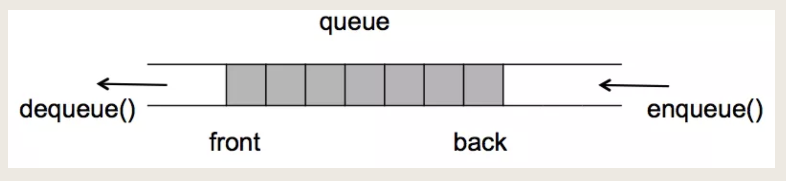

「 队列 」数据结构就是这样的，先进入队列的先出去，后进入队列的后出去。**必须从队尾插入新元素**，队列中的元素只能从队首出，这也就是「 队列 」操作受限制的地方了。

与堆栈类似，队列既可以用 「 数组 」 来实现，也可以用 「 链表 」 来实现。

# 二、「 队列 」的类型
* 顺序队列

* 链式队列

* 循环队列

* 优先队列

## 1. 用数组实现的队列，叫做 顺序队列
### 用数组实现的思路是这样的：

1. 初始化一个长度为n的数组，

2. 创建2个变量指针front和rear，front用来标识队头的下标，而rear用来标识队尾的下标。

3. 因为队列总是从对头取元素，从队尾插入数据。

4. 因此我们在操作这个队列的时候通过移动front和rear这两个指针的指向即可。初始化的时候front和rear都指向第0个位置。

### 当有元素需要入队的时候：

1. 首先判断一下队列是否已经满了，通过rear与n的大小比较可以进行判断，

2. 如果相等则说明队列已满（队尾没有空间了），不能再插入了。

3. 如果不相等则允许插入，将新元素赋值到数组中rear指向的位置，然后rear指针递增加一（即向后移动了一位），不停的往队列中插入元素，rear不停的移动，如图：
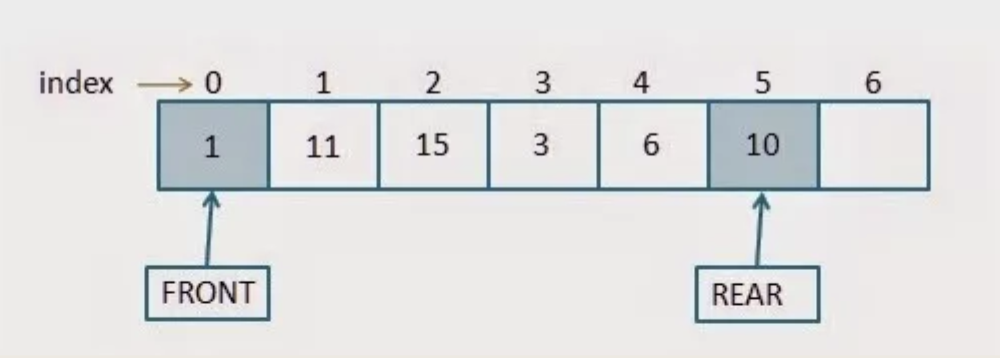

当队列装满的时候，则是如下情况：
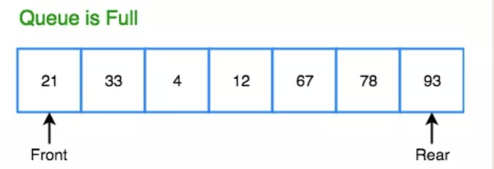

### 当需要做出队操作时：
1. 首先要判断队列是否为空，

2. 如果front指针和rear指针指向同一个位置（即front==rear）则说明队列是空的，无法做出队操作。

3. 如果队列不为空，则可以进行出队操作，将front指针所指向的元素出队，然后front指针递增加一（即向后移动了一位），假如上图的队列出队了2个元素：

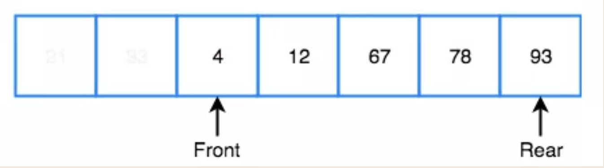

所以对于数组实现的队列而言，需要用2个指针来控制（front和rear），并且无论是做入队操作还是出队操作，front或rear都是往后移动，并不会往前移动。入队的时候是rear往后移动，出队的时候是front往后移动。出队和入队的时间复杂度都是O(1)的。

## 2. 用链表实现的队列，叫做 链式队列
用链表来实现也比较简单，与数组实现类似，也是需要2个指针来控制（front和rear），如图：

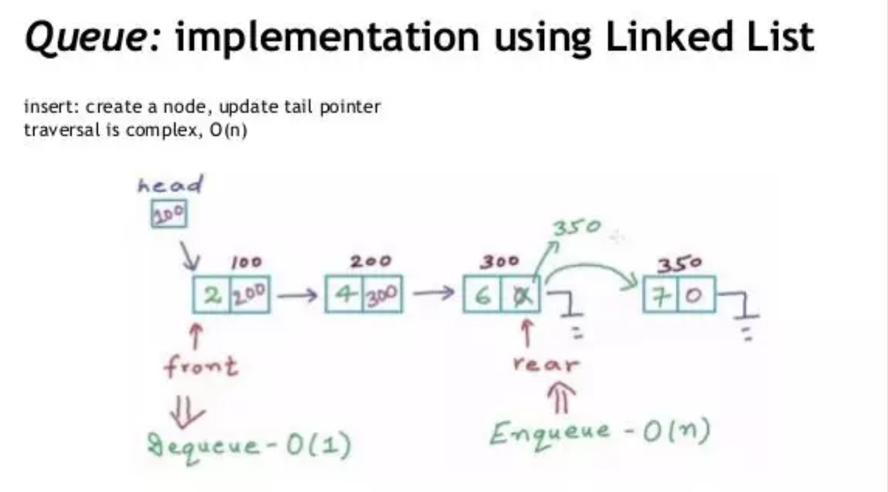

* 当进行入队操作时，让新节点的Next指向rear的Next，再让rear的Next指向新节点，最后让rear指针向后移动一位（即rear指针指向新节点），如上图右边部分。

* 当进行出队操作时，直接将front指针指向的元素出队，同时让front指向下一个节点（即将front的Next赋值给front指针），如上图左边部分。

## 3. 循环队列
循环队列是指队列是前后连成一个圆圈，它以循环的方式去存储元素，但还是会按照队列的先进先出的原则去操作。

循环队列是基于数组实现的队列，但它比普通数据实现的队列带来的好处是显而易见的，它能更有效率的利用数组空间，且不需要移动数据。

普通的数组队列在经过了一段时间的入队和出队以后，尾指针rear就指向了数组的最后位置了，没法再往队列里插入数据了，

但是数组的前面部分（front的前面）由于旧的数据曾经出队了，所以会空出来一些空间，这些空间就没法利用起来，如图：
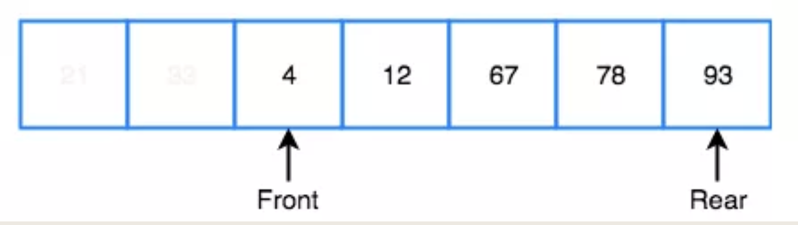

当然可以在数组尾部已满的这种情况下，去移动数据，把数据所有的元素都往前移动以填满前面的空间，释放出尾部的空间，以便尾部还可以继续插入新元素。但是这个移动也是消耗时间复杂度的。

而循环队列就可以天然的解决这个问题，下面是循环队列的示意图：

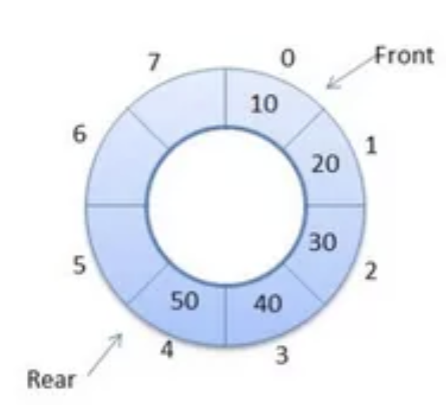


循环队列也是一种线性数据结构，只不过它的最后一个位置并不是结束位。

对于循环队列，头指针front始终指向队列的前面，尾指针rear始终指向队列的末尾。

在最初阶段，头部和尾部的指针都是指向的相同的位置，此时队列是空的，如图：

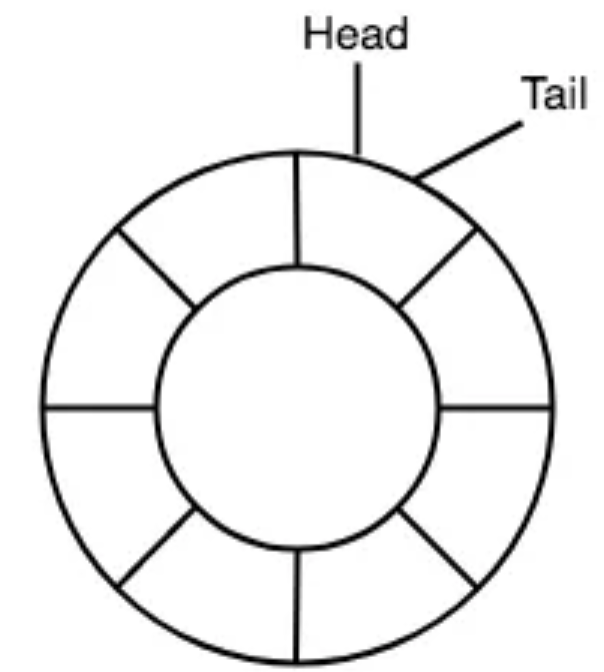

当有新元素要插入到这个循环队列的时候（入队），新元素就会被添加到队尾指针rear指向的位置（rear和tail这两个英文单词都是表示队尾指针的，不同人喜欢的叫法不一样），并且队尾指针就会递增加一，指向下一个位置，如图：

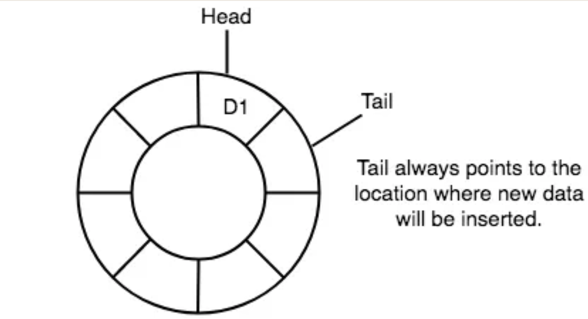

当需要做出队操作时，直接将头部指针front指向的元素进行出队（我们常用 front 或 head 英文单词来表示头部指针，凭个人喜好），并且头部指针递增加一，指向下一个位置，如图：

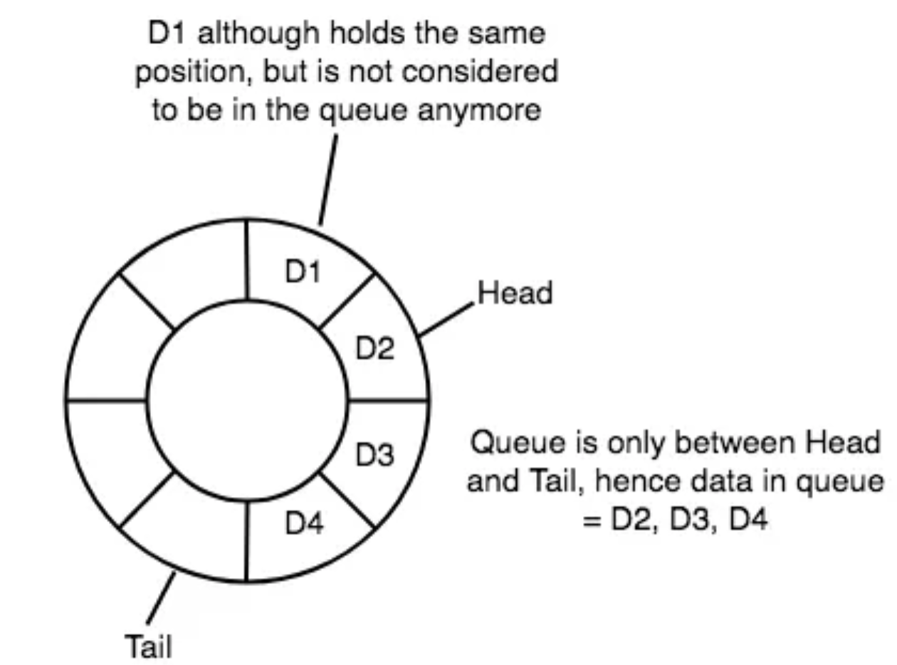

上图中，D1元素被出队列了，头指针head也指向了D2，不过D1元素的实际数据并没有被删除，但即使没有删除，D1元素也不属于队列中的一部分了，队列只承认队头和队尾之间的数据，其它数据并不属于队列的一部分。

当继续再往队列中插入元素，当tail到达队列的尾部的时候：

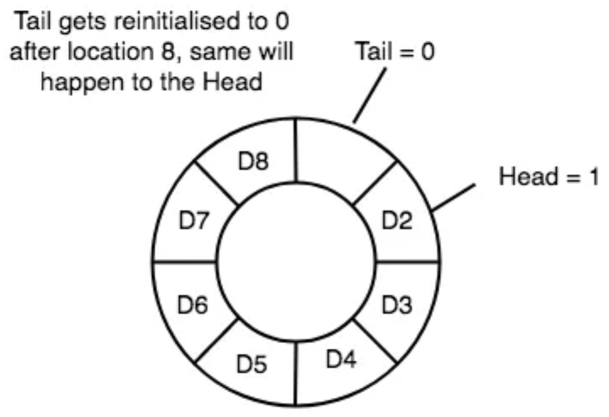

tail的下标就有重新变成了0，此时队列已经真的满了。

不过此处有个知识点需要注意，在上述队列满的情况下，其实还是有一个空间是没有存储数据的，这是循环队列的特性，只要队列不为空，那么就必须让head和tail之间至少间隔一个空闲单元，相当于浪费了一个空间吧。

假如此时我们将队列中的D2、D3、D4、D5都出队，那队列就又有空间了，我们又可以继续入队，我们将D9、D10入队，状态如下：

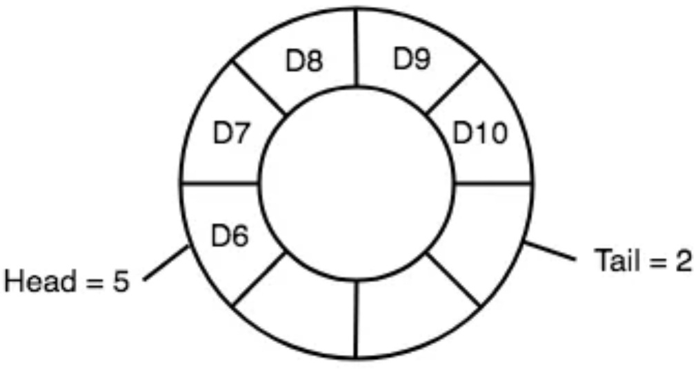

此时，头指针的下标已经大于尾指针的下标了，这也是正式循环队列的特性导致的。

所以可以看到，整个队列的入队和出队的过程，就是头指针head和尾指针tail互相追赶的过程，如果tail追赶上了head就说明队满了（前提是相隔一个空闲单元），如果head追赶上了tail就说明队列空了。

因此循环队列中，
* **判断队列为空的条件是：head==tail。**

* 判断队列为满的情况就是：tail+1=head（即tail的下一个是head，因为前面说了不为空的情况下两者之间需相隔一个单元），不过如果tail与head正好一个在队头一个在队尾（即tail=7，head=0）的时候，队列也是满的，但上述公式就不成立了，
**因此正确判断队满的公式应该是：(tail+1)%n=head**

# 4. 优先队列

优先队列（priority Queue）是一种特殊的队列，它不遵守先进先出的原则，它是按照优先级出队列的。

分为最大优先队列（是指最大的元素优先出队）和最小优先队列（是指最小的元素优先出队）。

一般用堆来实现优先队列。

# 三、「 队列 」的算法实践？
## 算法题1：使用栈实现队列的下列操作：
```
push(x) -- 将一个元素放入队列的尾部。
pop() -- 从队列首部移除元素。
peek() -- 返回队列首部的元素。
empty() -- 返回队列是否为空。
```
解题思路：堆栈是FILO先进后出，队列是FIFO先进先出，
要使用堆栈来实现队列的功能，可以采用2个堆栈的方式。
堆栈A和堆栈B，当有元素要插入的时候，就往堆栈A里插入。
当要移除元素的时候，先将堆栈A里的元素依次出栈放入到堆栈B中，再从堆栈B的顶部出数据。
如此便基于2个堆栈实现了先进先出的原则了。
```java
class MyQueue {

    private Stack<Integer> s1 = new Stack<>();
    private Stack<Integer> s2 = new Stack<>();
    private int fornt;


    /** Initialize your data structure here. */
    public MyQueue() {

    }

    /** 
     * Push element x to the back of queue. 
	 * 时间复杂度为O(1)
     */
    public void push(int x) {
        if(s1.empty()) fornt = x;
        s1.push(x);
    }

    /** Removes the element from in front of queue and returns that element. 
     * 时间复杂度为O(n)
     */
    public int pop() {
        if(s2.empty()){
            while(!s1.empty()){
                s2.push(s1.pop());
            }
        }
         return s2.pop();
    }

    /** Get the front element. 
	 * 时间复杂度为O(1)	
     */
    public int peek() {
        if(s2.empty()){
            return fornt;
        }
        return s2.peek();
    }

    /** Returns whether the queue is empty. */
    public boolean empty() {
        return s1.empty()&&s2.empty();
    }
}   
```

## 算法题2：使用队列来实现堆栈的下列操作：
```log
push(x) -- 元素 x 入栈
pop() -- 移除栈顶元素
top() -- 获取栈顶元素
empty() -- 返回栈是否为空
```
解题思路：由于需要使用FIFO的队列模拟出FILO的堆栈效果，因此需要使用2个队列来完成，
队列A和队列B，当需要进行入栈操作的时候，直接往队列A中插入元素。

当需要进行出栈操作的时候，先将队列A中的前n-1个元素依次出队移动到队列B中，
这样队列A中剩下的最后一个元素其实就是我们所需要出栈的元素了，将这个元素出队即可。

```java
class MyStack {

    private Queue<Integer> q1 = new LinkedList<>();
    private Queue<Integer> q2 = new LinkedList<>();
    int front;

    /** Initialize your data structure here. */
    public MyStack() {

    }

    /** Push element x onto stack. */
    public void push(int x) {
        q1.add(x);
        front = x;
    }

    /** Removes the element on top of the stack and returns that element. */
    public int pop() {
        while(q1.size()>1){
            front = q1.remove();
            q2.add(front);
        }
        int val = q1.remove();
        Queue<Integer> temp = q2;
        q2 = q1;
        q1 = temp;
        return val;
    }

    /** Get the top element. */
    public int top() {
        return front;
    }

    /** Returns whether the stack is empty. */
    public boolean empty() {
        return q1.size()==0;
    }
}
```

入栈的时间复杂度为O(1)，出栈的时间复杂度为O(n)

这道题其实还有另一个解法，只需要一个队列就可以做到模拟出堆栈，思路就是：当需要进行入栈操作的时候，先将新元素插入到队列的队尾中，
再将这个队列中的其它元素依次出队，队列的特性当然是从队头出队了，
但是出来的元素再让它们从队尾入队，这样依次进行，留下刚才插入的新元素不动，这个时候，
这个新元素其实就被顶到了队头了，新元素入栈的动作就完成了。当需要进行出栈操作的时候，就直接将队列队头元素出队即是了。
思路已经写出来了，代码的话就留给大家练习了哦。
