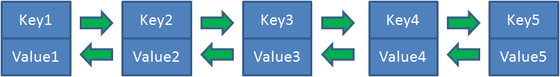
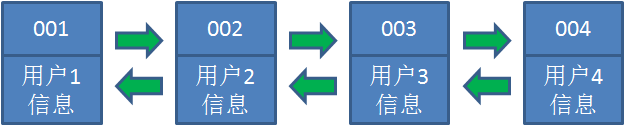
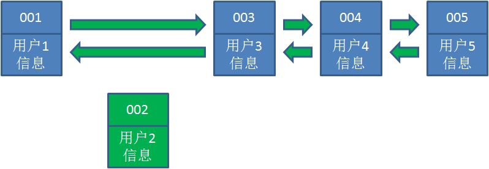
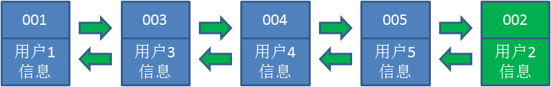
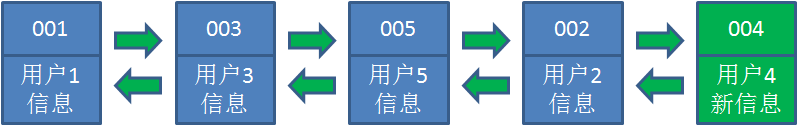
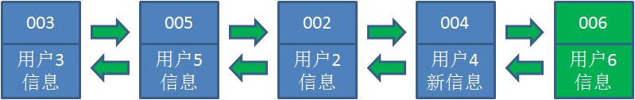

## 什么是LRU算法


LRU算法又称最近最少使用算法，它的基本思想是**长期不被使用的数据，在未来被用到的几率也不大，所以当新的数据进来时我们可以优先把这些数据替换掉**。　　

在LRU算法中，使用了一种有趣的数据结构，称为**哈希链表**。我们知道哈希表是由多个<Key,Value>对组成的，哈希链表是将这写节点链接起来，**每一个节点都有一个前驱结点和后驱节点，就像双向链表中的节点一样**。哈希表拥有了固定的排列顺序。




基于哈希链表的有序性，我们就可以把<Key,Value>按照最后的使用时间来排列。

## LRU算法的基本思路


假设我们使用哈希链表来缓存用户信息，目前缓存了4个用户，用户按照时间顺序从链表右端插入：



情景一：当访问用户5时，由于哈希链表中没有用户5的数据，从数据库中读取出来插入到缓存中


情景二：当访问用户2时，由于哈希链表中有用户2的数据，我们把它掐断，放到链表最右段





情景三：同情景二，这次访问用户4的数据




情景四：当用户访问用户6，用户6在缓存中没有，需要插入到链表中，但此时链表长度已满，我们把最左端的用户删掉，然后插入用户6



>说明：我们仔细回顾一下，当缓存命中时，我们就把它放到最右端，也就是说排在右边的是最近被使用过的，那左边的当然是相对较少被访问过的，所以当缓存不命中的时候，我们就把最左边的剔除掉，所以这里就体现了最近最少使用的原则。


> 缓存的容量是有限的
当缓存容量不足以存放需要缓存的新数据时，必须丢掉最不常用的缓存数据
使用hashmap存储数据，双向链表对数据排序，和LinkedHashMap相似
写入缓存，或查询缓存时，把数据移到头结点

## LRU算法的基本实现

```java
package com.study.demo;

import java.util.HashMap;

/**
 * Created by Administrator on 2019\5\4 0004.
 */
public class LRUCache<K, V> {

    private int currentCacheSize;
    private int CacheCapcity;
    private HashMap<K,CacheNode> caches;
    private CacheNode first;
    private CacheNode last;

    public LRUCache(int size){
        currentCacheSize = 0;
        this.CacheCapcity = size;
        caches = new HashMap<K,CacheNode>(size);
    }

    public void put(K k,V v){
        CacheNode node = caches.get(k);
        if(node == null){
            if(caches.size() >= CacheCapcity){

                caches.remove(last.key);
                removeLast();
            }
            node = new CacheNode();
            node.key = k;
        }
        node.value = v;
        moveToFirst(node);
        caches.put(k, node);
    }

    public Object  get(K k){
        CacheNode node = caches.get(k);
        if(node == null){
            return null;
        }
        moveToFirst(node);
        return node.value;
    }

    public Object remove(K k){
        CacheNode node = caches.get(k);
        if(node != null){
            if(node.pre != null){
                node.pre.next=node.next;
            }
            if(node.next != null){
                node.next.pre=node.pre;
            }
            if(node == first){
                first = node.next;
            }
            if(node == last){
                last = node.pre;
            }
        }

        return caches.remove(k);
    }

    public void clear(){
        first = null;
        last = null;
        caches.clear();
    }


    private void moveToFirst(CacheNode node){
        if(first == node){
            return;
        }
        if(node.next != null){
            node.next.pre = node.pre;
        }
        if(node.pre != null){
            node.pre.next = node.next;
        }
        if(node == last){
            last= last.pre;
        }
        if(first == null || last == null){
            first = last = node;
            return;
        }

        node.next=first;
        first.pre = node;
        first = node;
        first.pre=null;

    }

    private void removeLast(){
        if(last != null){
            last = last.pre;
            if(last == null){
                first = null;
            }else{
                last.next = null;
            }
        }
    }
    @Override
    public String toString(){
        StringBuilder sb = new StringBuilder();
        CacheNode node = first;
        while(node != null){
            sb.append(String.format("%s:%s ", node.key,node.value));
            node = node.next;
        }

        return sb.toString();
    }

    class CacheNode{
        CacheNode pre;
        CacheNode next;
        Object key;
        Object value;
        public CacheNode(){

        }
    }

    public static void main(String[] args) {

        LRUCache<Integer,String> lru = new LRUCache<Integer,String>(3);

        lru.put(1, "a");    // 1:a
        System.out.println(lru.toString());
        
        lru.put(2, "b");    // 2:b 1:a
        System.out.println(lru.toString());
        
        lru.put(3, "c");    // 3:c 2:b 1:a
        System.out.println(lru.toString());
        
        lru.put(4, "d");    // 4:d 3:c 2:b
        System.out.println(lru.toString());
        
        lru.put(1, "aa");   // 1:aa 4:d 3:c
        System.out.println(lru.toString());
        
        lru.put(4, "dd");   // 4:dd 1:aa 3:c 
        System.out.println(lru.toString());

        System.out.println(lru.get(1));//aa
        System.out.println(lru.toString());//1:aa 4:dd 3:c

    }

}
```


