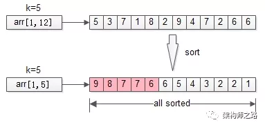
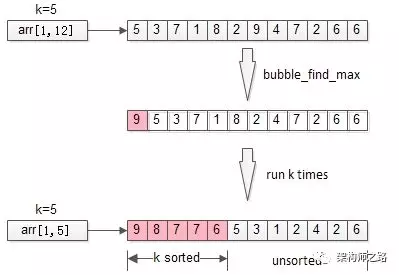
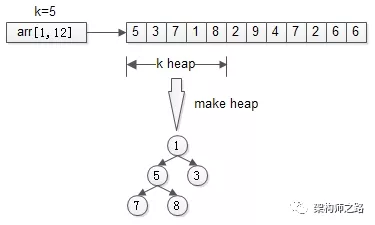
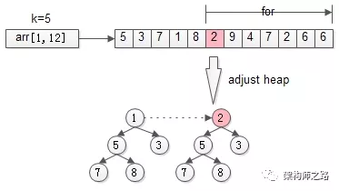
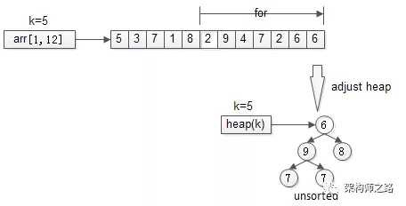
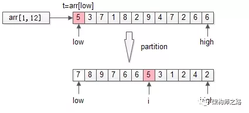
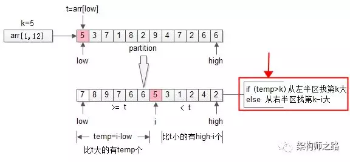

# 问题描述

从arr[1, n]这n个数中，找出最大的k个数，这就是经典的TopK问题。

# 例子

从arr[1, 12]={5,3,7,1,8,2,9,4,7,2,6,6} 这n=12个数中，找出最大的k个，k=5。

# 解答
## 方案一：排序



排序是最容易想到的方法，将n个数排序之后，取出最大的k个，即为所得。 
伪代码：
```java
sort(arr, 1, n);
return arr[1, k];
```
### 时间复杂度：
O(n\*lg(n))
### 分析：
明明只需要TopK，却将全局都排序了，这也是这个方法复杂度非常高的原因。那能不能不全局排序，而只局部排序呢？这就引出了第二个优化方法。

## 方案二：局部排序

不再全局排序，只对最大的k个排序。



冒泡是一个很常见的排序方法，每冒一个泡，找出最大值，冒k个泡，就得到TopK。

### 伪代码：
```java
for(i=1 to k){
     bubble_find_max(arr,i);
}
return arr[1, k];
```
### 时间复杂度

O(n\*k)

### 分析：
冒泡，将全局排序优化为了局部排序，非TopK的元素是不需要排序的，节省了计算资源。不少朋友会想到，需求是TopK，是不是这最大的k个元素也不需要排序呢？这就引出了第三个优化方法。

## 方案三：堆

思路：只找到TopK，不排序TopK。




先用前k个元素生成一个小顶堆，这个小顶堆用于存储，当前最大的k个元素。



接着，从第k+1个元素开始扫描，和堆顶（堆中最小的元素）比较，**如果被扫描的元素大于堆顶，则替换堆顶的元素，并调整堆**，以保证堆内的k个元素，总是当前最大的k个元素。


直到，扫描完所有n-k个元素，最终堆中的k个元素，就是猥琐求的TopK。

### 伪代码：
```java
heap[k] = make_heap(arr[1, k]);
for(i=k+1 to n){
         adjust_heap(heep[k],arr[i]);
}
return heap[k];
```

### 时间复杂度：
O(n\*lg(k))

n个元素扫一遍，假设运气很差，每次都入堆调整，调整时间复杂度为堆的高度，即lg(k)，故整体时间复杂度是n\*lg(k)。
### 分析：
堆，将冒泡的TopK排序优化为了TopK不排序，节省了计算资源。堆，是求TopK的经典算法，那还有没有更快的方案呢？

## 方案四：随机选择

随机选择算在是《算法导论》中一个经典的算法，其时间复杂度为O(n)，是一个线性复杂度的方法。

### 快速排序
其伪代码是：
```java
void quick_sort(int[]arr, int low, inthigh){

         if(low== high) return;

         int i = partition(arr, low, high);

         quick_sort(arr, low, i-1);

         quick_sort(arr, i+1, high);

}
```

其核心算法思想是，**分治法**。

**分治法（Divide&Conquer）**，**把一个大的问题，转化为若干个子问题（Divide），每个子问题“都”解决**，大的问题便随之解决（Conquer）。这里的关键词是“**都**”。从伪代码里可以看到，快速排序递归时，先通过partition把数组分隔为两个部分，两个部分“都”要再次递归。

分治法有一个特例，叫减治法。 

**减治法（Reduce&Conquer），把一个大的问题，转化为若干个子问题（Reduce），这些子问题中“只”解决一个** , 大的问题便随之解决（Conquer）。这里的关键词是“**只**”。


**二分查找binary_search**，BS，是一个典型的运用减治法思想的算法，其伪代码是：
```java
int BS(int[]arr, int low, inthigh, int target){

         if(low> high) return -1;

         mid= (low+high)/2;

         if(arr[mid]== target) return mid;

         if(arr[mid]> target)

                   return BS(arr, low, mid-1, target);

         else

                   return BS(arr, mid+1, high, target);

}
```

从伪代码可以看到，二分查找，一个大的问题，可以用一个mid元素，分成左半区，右半区两个子问题。而左右两个子问题，只需要解决其中一个，递归一次，就能够解决二分查找全局的问题。 

通过分治法与减治法的描述，可以发现，**分治法的复杂度一般来说是大于减治法的**：

* 快速排序：O(n\*lg(n))

* 二分查找：O(lg(n)) 


快速排序的核心是：
`i = partition(arr, low, high);`

partition会把整体分为两个部分。更具体的，会用数组arr中的一个元素（默认是第一个元素t=arr[low]）为划分依据，将数据arr[low, high]划分成左右两个子数组：

* 左半部分，都比t大

* 右半部分，都比t小

* 中间位置i是划分元素



以上述TopK的数组为例，先用第一个元素t=arr[low]为划分依据，扫描一遍数组，把数组分成了两个半区：
* 左半区比t大
* 右半区比t小
* 中间是tpartition返回的是t最终的位置i。

partition的时间复杂度是O(n)。

### partition和TopK问题有什么关系呢？

TopK是希望求出arr[1,n]中最大的k个数，那如果找到了第k大的数，做一次partition，不就一次性找到最大的k个数了么？即partition后左半区的k个数。

问题变成了arr[1, n]中**找到第k大的数**。

再回过头来看看第一次partition，划分之后：i = partition(arr, 1, n);

* 如果i大于k，则说明arr[i]左边的元素都大于k，于是只递归arr[1, i-1]里第k大的元素即可；

* 如果i小于k，则说明说明第k大的元素在arr[i]的右边，于是只递归arr[i+1, n]里第k-i大的元素即可；


这就是**随机选择**算法randomized_select，RS，其伪代码如下：
```java
int RS(arr, low, high, k){

  if(low== high) return arr[low];

  i= partition(arr, low, high);

  temp= i-low; //数组前半部分元素个数

  if(temp>=k)

      return RS(arr, low, i-1, k); //求前半部分第k大

  else

      return RS(arr, i+1, high, k-i); //求后半部分第k-i大

}
```




这是一个典型的减治算法，递归内的两个分支，最终只会执行一个，它的时间复杂度是O(n)。

通过随机选择（randomized_select），找到arr[1, n]中第k大的数，再进行一次partition，就能得到TopK的结果。


再次强调一下：
* 分治法，大问题分解为小问题，小问题都要递归各个分支，例如：快速排序

* 减治法，大问题分解为小问题，小问题只要递归一个分支，例如：二分查找，随机选择
