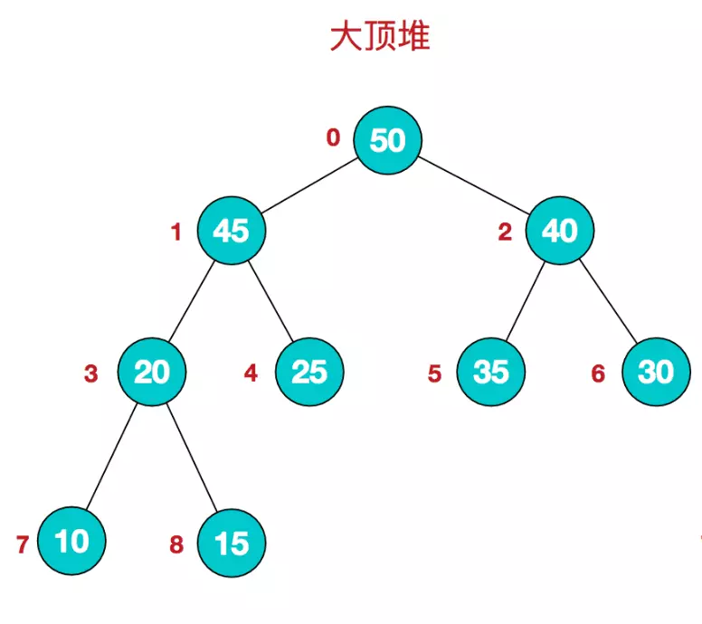
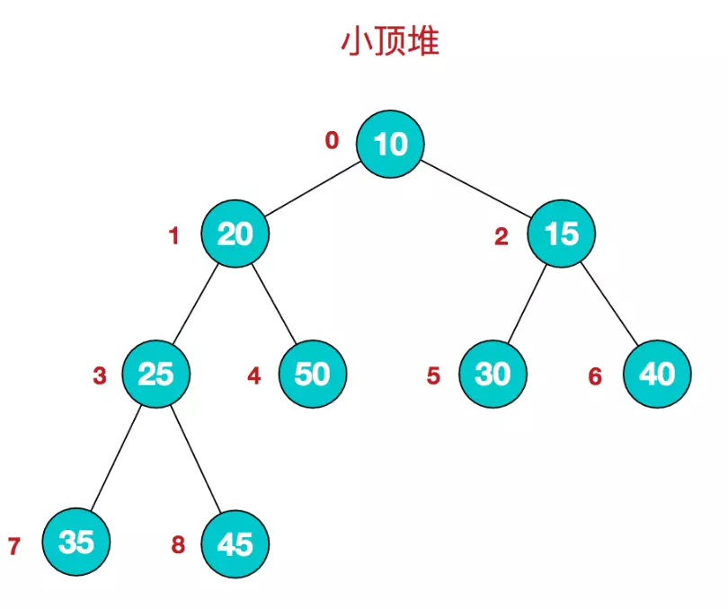

# 二分查找
## 算法思想
又叫折半查找，**要求待查找的序列有序。**

每次取中间位置的值与待查关键字比较，

* 如果中间位置的值比待查关键字大，则在前半部分循环这个查找的过程；

* 如果中间位置的值比待查关键字小，则在后半部分循环这个查找的过程。
 
直到查找到了为止，否则序列中没有待查的关键字。

## 实现

### 1. 非递归代码
```java
public static int biSearch(int []array,int a){
        int lo=0;
        int hi=array.length-1;
        int mid;
        while(lo<=hi){
            mid=(lo+hi)/2;
            if(array[mid]==a){
                return mid+1;
            }else if(array[mid]<a){
                lo=mid+1;
            }else{
                hi=mid-1;
            }
        }
        return -1;
    }
```
### 2. 递归实现
```java
public static int sort(int []array,int a,int lo,int hi){
        if(lo<=hi){
            int mid=(lo+hi)/2;
            if(a==array[mid]){
                return mid+1;
            }
            else if(a>array[mid]){
                return sort(array,a,mid+1,hi);
            }else{
                return sort(array,a,lo,mid-1);
            }
        }
        return -1;
    }
```
时间复杂度为 O(logN)  :
用f(n)来表示数据量为n时，算法的计算次数。
* 当n=1时，函数只比较1次，即: `f(1)=1`

* 当n很大时，二分会进行一次比较，然后进行左侧或者右侧的递归，以减少一半的数据量：
f(n)的计算次数，等于f(n/2)的计算次数，再加1次计算，即：`f(n)=f(n/2)+1`

对 `f(n)=f(n/2)+1` 展开:
```log
f(n)=f(n/2)+1
f(n/2)=f(n/4)+1
f(n/4)=f(n/8)+1
…
f(n/2^(m-1))=f(n/2^m)+1
 
上面共m个等式，左侧和右侧分别相加：
f(n)+f(n/2)+…+f(n/2^(m-1)) = [f(n/2)+1]+[f(n/4)+1]+…+[f(n/2^m)]+[1]

即得到：
f(n)=f(n/2^m)+m

再配合 f(1)=1
即，n/2^m=1时, f(n/2^m)=1, 此时m=log(n), 这一步，这是分析这个算法的关键。
 
将m=lg(n)带入，得到：
f(n)=1+log(n)
```
所以时间复杂度为O(logN) 。

### 3. 查找第一个元素出现的位置（元素允许重复）

当中间值大于等于目标元素的时候，我们要保留当前中间值的位置，并且在左边继续查找。
```java
public static int biSearch(int []array,int a){
        int n=array.length;
        int low=0;
        int hi=n-1;
        int mid=0;
        while(low<hi){
            mid = (low + hi) >> 1;
            if(array[mid]<target){
                low = mid + 1;
            }else {
                hi = mid;
            }
        }
        if (target == array[hi]) {
            System.out.println("元素第一次出现的位置是："+ hi);
        }   
    }
```
### 4. 查询元素最后一次出现的位置

当中间值小于等于目标元素的时候，我们要保留中间值的位置，并且在右边继续查找。

```java
public static int biSearch(int []array,int a){
       int n=array.length;
		int low=0;
		int hi=n-1;
		int mid=0;
		while(low<hi){
			mid = (low + hi+1) >> 1;// 保证取到中间靠后的位置,这是保证找到元素最后一次出现位置的关键，如果没有保证取到中间靠后的位置，会导致死循环。
			if(array[mid]>target){
				hi = mid - 1;
			}else {
				low = mid;
			}
		}

		if (target == array[low]) {
			System.out.println("元素最后一次出现的位置是："+ low);
		}
    }
```

# 冒泡排序

冒泡排序（Bubble Sort）是一种简单的排序算法。它重复地走访过要排序的数列，一次比较两个元素，如果他们的顺序错误就把他们交换过来。走访数列的工作是重复地进行直到没有再需要交换，也就是说该数列已经排序完成。这个算法的名字由来是因为越小的元素会经由交换慢慢“浮”到数列的顶端。　　

冒泡排序算法的运作如下:

1. 比较相邻的元素。如果第一个比第二个大，就交换他们两个。 

2. 对每一对相邻元素作同样的工作，从开始第一对到结尾的最后一对。在这一点，最后的元素应该会是最大的数。

3. 针对所有的元素重复以上的步骤，除了最后一个。 

4. 持续每次对越来越少的元素重复上面的步骤，直到没有任何一对数字需要比较。

```java
public class BubbleSort{
     public static void main(String[] args){
         int score[] = {67, 69, 75, 87, 89, 90, 99, 100};
         for (int i = 0; i < score.length -1; i++){    //最多做n-1趟排序
             for(int j = 0 ;j < score.length - i - 1; j++){    //对当前无序区间score[0......length-i-1]进行排序(j的范围很关键，这个范围是在逐步缩小的)
                 if(score[j] < score[j + 1]){    //把小的值交换到后面
                     int temp = score[j];
                     score[j] = score[j + 1];
                     score[j + 1] = temp;
                 }
             }            
             System.out.print("第" + (i + 1) + "次排序结果：");
             for(int a = 0; a < score.length; a++){
                 System.out.print(score[a] + "\t");
             }
             System.out.println("");
         }
             System.out.print("最终排序结果：");
             for(int a = 0; a < score.length; a++){
                 System.out.print(score[a] + "\t");
        }
     }
 }
```

分析：冒泡排序，可以看成三个规则的组合：

1. 外层for循环

2. 内层for循环

3. 最内层的swap

故，冒泡排序的时间复杂度为：
O(n) * O(n) * O(1) = O(n^2)

# 快速排序quick_sort
## 快速排序的原理
> 选择一个关键值作为基准值。比基准值小的都在左边序列（一般是无序的），比基准值大的都在右边（一般是无序的）。一般选择序列的第一个元素。

一次循环中，从后往前比较，用基准值和最后一个值比较，如果比基准值小的交换位置，如果没有继续比较下一个，直到找到第一个比基准值小的值才交换。

找到这个值之后，又从前往后开始比较，如果有比基准值大的，交换位置，如果没有继续比较下一个，直到找到第一个比基准值大的值才交换。

直到从前往后的比较索引>从后往前比较的索引，结束第一次循环，

此时，对于基准值来说，左右两边就是有序的了。

接着分别比较左右两边的序列，重复上述的循环。

```java
public void fastSort() {
		System.out.println("Hello World");
		int[] a = {12, 20, 5, 16, 15, 1, 30, 45, 23, 9};
		int start = 0;
		int end = a.length - 1;
		sort(a, start, end);
		for (int i = 0; i < a.length; i++) {
			System.out.println(a[i]);
		}
	}

	public void sort(int[] a, int low, int high) {
		int start = low;
		int end = high;
		int key = a[low];


		while (end > start) {
			//从后往前比较
			while (end > start && a[end] >= key)  //如果没有比关键值小的，比较下一个，直到有比关键值小的交换位置，然后又从前往后比较
				end--;
			if (a[end] <= key) {
				int temp = a[end];
				a[end] = a[start];
				a[start] = temp;
			}
			//从前往后比较
			while (end > start && a[start] <= key)//如果没有比关键值大的，比较下一个，直到有比关键值大的交换位置
				start++;
			if (a[start] >= key) {
				int temp = a[start];
				a[start] = a[end];
				a[end] = temp;
			}
			//此时第一次循环比较结束，关键值的位置已经确定了。左边的值都比关键值小，右边的值都比关键值大，但是两边的顺序还有可能是不一样的，进行下面的递归调用
		}
		//递归
		if (start > low) sort(a, low, start - 1);//左边序列。第一个索引位置到关键值索引-1
		if (end < high) sort(a, end + 1, high);//右边序列。从关键值索引+1到最后一个
	}
```
## 时间复杂度计算
1. 仍用f(n)来表示数据量为n时，算法的计算次数，很容易知道,当n=1时，quick_sort函数只计算1次
`f(1)=1`
 
2. 在n很大时：
第一步，先做一次分区；
第二步，左半区递归；
第三步，右半区递归；
即：
`f(n)=n+f(n/2)+f(n/2)=n+2*f(n/2)`
>画外音：
> 1. 分区本质是一个for，计算次数是n；
> 2. 二分查找只需要递归一个半区，而快速排序左半区和右半区都要递归，这一点在分治法与减治法一章节已经详细讲述过；
 
 
 展开`f(n)=n+f(n/2)+f(n/2)=n+2*f(n/2)` ：
 ```log
f(n)=n+2*f(n/2)
f(n/2)=n/2+2*f(n/4)
f(n/4)=n/4+2*f(n/8)
…
f(n/2^(m-1))=n/2^(m-1)+2f(n/2^m)
 
上面共m个等式，逐步带入，于是得到：
f(n)=n+2*f(n/2)
=n+2*[n/2+2*f(n/4)]=2n+4*f(n/4)
=2n+4*[n/4+2*f(n/8)]=3n+8f(n/8)
=…
=m*n+2^m*f(n/2^m)
 
再配合f(1)=1:
即，n/2^m=1时, f(n/2^m)=1, 此时m=lg(n), 这一步，这是分析这个算法的关键。

将m=lg(n)带入，得到：
f(n)=lg(n)*n+2^(lg(n))*f(1)=n*lg(n)+n
```
故，快速排序的时间复杂度是n*lg(n)。

# 堆排序

堆是具有以下性质的完全二叉树：

* 每个结点的值都大于或等于其左右孩子结点的值，称为大顶堆；

* 或者每个结点的值都小于或等于其左右孩子结点的值，称为小顶堆。





堆排序（Heapsort）是指利用堆这种数据结构所设计的一种排序算法。

堆积是一个近似完全二叉树的结构，并同时满足堆积的性质：即子结点的键值或索引总是小于（或者大于）它的父节点。

堆排序可以说是一种利用堆的概念来排序的选择排序。分为两种方法：

* 大顶堆：每个节点的值都大于或等于其子节点的值，在堆排序算法中用于升序排列；

* 小顶堆：每个节点的值都小于或等于其子节点的值，在堆排序算法中用于降序排列；

堆排序的平均时间复杂度为 Ο(nlogn)。

堆排序的算法步骤：

1. 先n个元素的无序序列，构建成大顶堆
2. 将根节点与最后一个元素交换位置，（将最大元素"沉"到数组末端）
3. 交换过后可能不再满足大顶堆的条件，所以需要将剩下的n-1个元素重新构建成大顶堆
4. 重复第二步、第三步直到整个数组排序完成

构建大顶堆的时间复杂度为Ο(logn)，一共n个元素，交换后要重新构建，所以时间复杂度为Ο(nlogn)。


